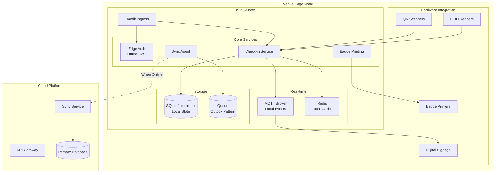
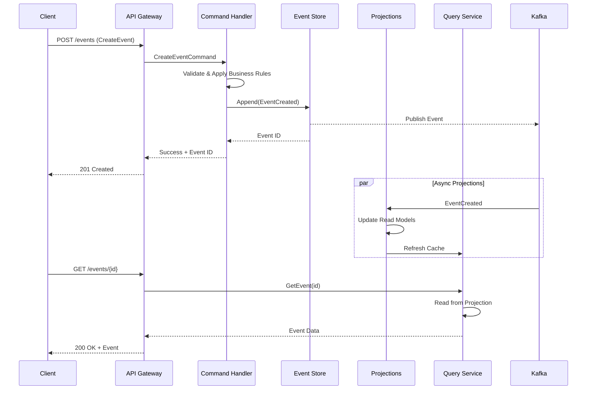
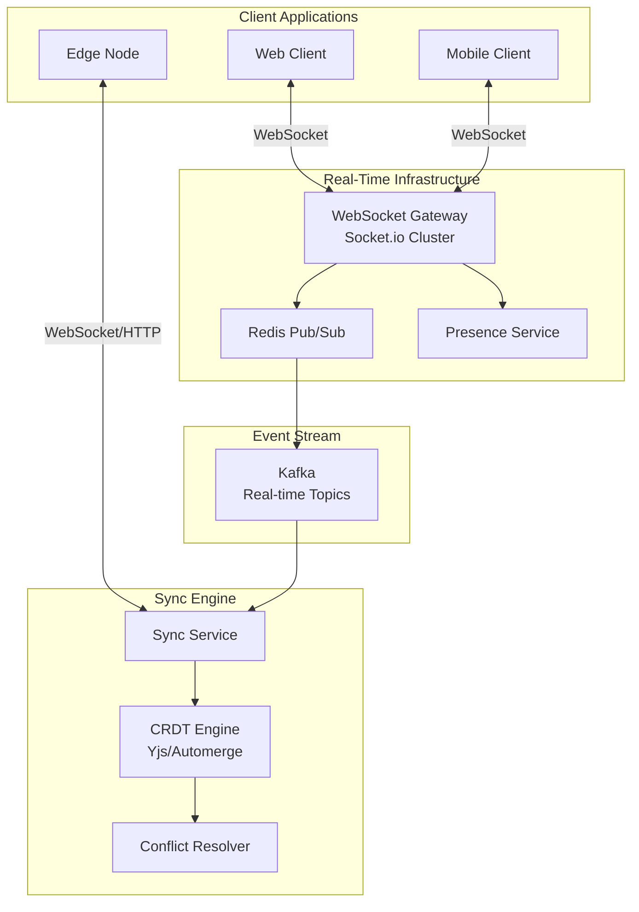
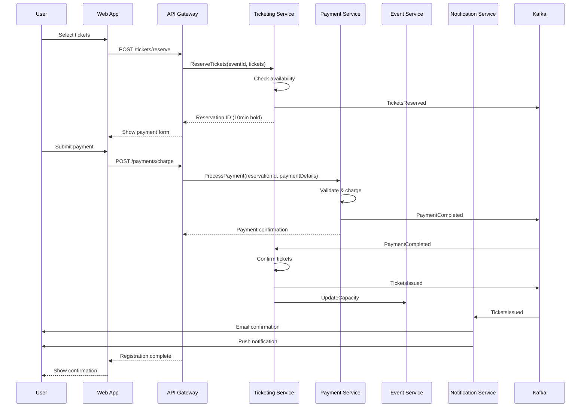
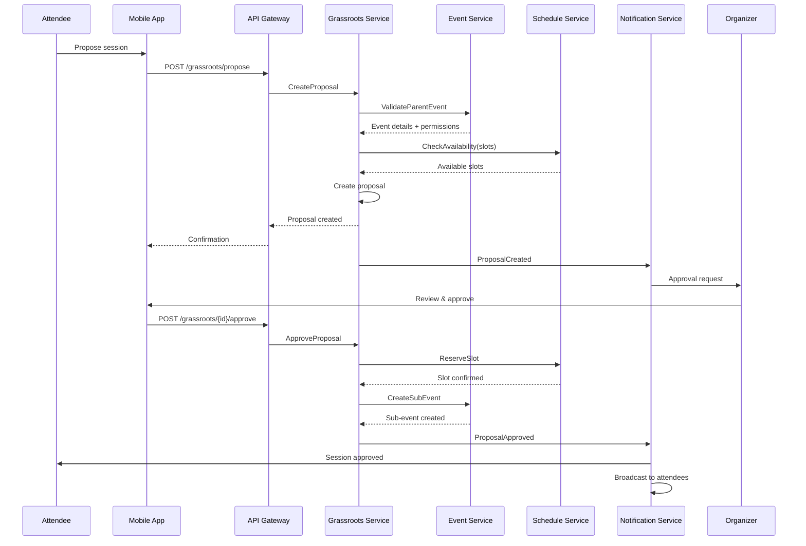
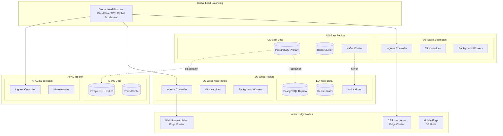

# ADR-001: Core Platform Architecture

| Field | Value |
|-------|-------|
| **Status** | Proposed |
| **Date** | 2026-01-30 |
| **Decision Makers** | Architecture Team |
| **Consulted** | Engineering, DevOps, Product |
| **Informed** | All stakeholders |

---

## Context

Konferenco requires a robust, scalable architecture to support a wide spectrum of events:

- **Scale variance**: From intimate 50-person meetups to CES-scale conferences with 180,000+ attendees
- **Hybrid nature**: Physical venues with virtual participation, requiring real-time synchronization
- **Grassroots model**: Nested events where attendees can create sub-events within parent conferences
- **Global distribution**: Events span multiple time zones with attendees worldwide
- **Real-time requirements**: Live streaming, chat, Q&A, polling, networking features
- **Offline resilience**: Venue deployments must function with intermittent connectivity
- **Multi-tenancy**: Multiple organizations hosting events with data isolation

Traditional monolithic architectures cannot adequately address these requirements due to:
1. Scaling bottlenecks during peak registration periods
2. Single points of failure affecting all tenants
3. Inability to deploy edge nodes for venue-specific workloads
4. Difficulty in supporting diverse feature sets per event type

---

## Decision

We adopt a **Modular Event-Driven Architecture** combining:

1. **Domain-driven microservices** for core bounded contexts
2. **Event sourcing** for activity streams and audit trails
3. **CQRS** (Command Query Responsibility Segregation) for read-heavy operations
4. **Edge computing nodes** for venue deployments
5. **Hybrid data synchronization** using CRDTs for conflict resolution

### High-Level Architecture

```mermaid
graph TB
    subgraph "Client Layer"
        WEB[Web Application<br/>React/Next.js]
        MOBILE[Mobile Apps<br/>React Native]
        KIOSK[Venue Kiosks<br/>PWA]
        EMBED[Embedded Widgets<br/>iFrame SDK]
    end

    subgraph "Edge Layer"
        CDN[Global CDN<br/>CloudFlare/Fastly]
        EDGE_VENUE[Venue Edge Nodes<br/>K3s Clusters]
        STREAM_POP[Streaming POPs<br/>Regional Ingest]
    end

    subgraph "API Gateway Layer"
        GATEWAY[API Gateway<br/>Kong/Traefik]
        RATE[Rate Limiter<br/>Redis-based]
        AUTH_GW[Auth Filter<br/>JWT/OAuth2]
        GRAPHQL[GraphQL Federation<br/>Apollo Router]
    end

    subgraph "Core Services"
        subgraph "Event Domain"
            EVENT_SVC[Event Service]
            SCHEDULE_SVC[Schedule Service]
            VENUE_SVC[Venue Service]
            GRASSROOTS_SVC[Grassroots Service]
        end

        subgraph "User Domain"
            AUTH_SVC[Auth Service]
            USER_SVC[User Service]
            PROFILE_SVC[Profile Service]
            NETWORK_SVC[Networking Service]
        end

        subgraph "Content Domain"
            MEDIA_SVC[Media Service]
            STREAM_SVC[Streaming Service]
            CONTENT_SVC[Content Service]
        end

        subgraph "Engagement Domain"
            CHAT_SVC[Chat Service]
            QA_SVC[Q&A Service]
            POLL_SVC[Polling Service]
            NOTIF_SVC[Notification Service]
        end

        subgraph "Commerce Domain"
            TICKET_SVC[Ticketing Service]
            PAYMENT_SVC[Payment Service]
            SPONSOR_SVC[Sponsorship Service]
        end
    end

    subgraph "Event Backbone"
        KAFKA[Apache Kafka<br/>Event Streaming]
        SCHEMA_REG[Schema Registry<br/>Avro/Protobuf]
        KSQL[ksqlDB<br/>Stream Processing]
    end

    subgraph "Data Layer"
        subgraph "Primary Stores"
            POSTGRES[(PostgreSQL<br/>Transactional)]
            MONGO[(MongoDB<br/>Documents)]
            TIMESCALE[(TimescaleDB<br/>Time Series)]
        end

        subgraph "Caching & Search"
            REDIS[(Redis Cluster<br/>Cache/Sessions)]
            ELASTIC[(Elasticsearch<br/>Search/Analytics)]
        end

        subgraph "Media Storage"
            S3[Object Storage<br/>S3-compatible]
            TRANSCODE[Transcoding<br/>Pipeline]
        end
    end

    subgraph "Observability"
        PROM[Prometheus<br/>Metrics]
        GRAFANA[Grafana<br/>Dashboards]
        JAEGER[Jaeger<br/>Tracing]
        LOKI[Loki<br/>Logs]
    end

    WEB --> CDN
    MOBILE --> CDN
    KIOSK --> EDGE_VENUE
    EMBED --> CDN

    CDN --> GATEWAY
    EDGE_VENUE --> GATEWAY
    STREAM_POP --> STREAM_SVC

    GATEWAY --> AUTH_GW
    AUTH_GW --> GRAPHQL
    GRAPHQL --> EVENT_SVC
    GRAPHQL --> USER_SVC
    GRAPHQL --> MEDIA_SVC
    GRAPHQL --> TICKET_SVC

    EVENT_SVC --> KAFKA
    USER_SVC --> KAFKA
    CHAT_SVC --> KAFKA
    TICKET_SVC --> KAFKA

    KAFKA --> KSQL
    KAFKA --> NOTIF_SVC

    EVENT_SVC --> POSTGRES
    USER_SVC --> POSTGRES
    TICKET_SVC --> POSTGRES

    MEDIA_SVC --> MONGO
    CONTENT_SVC --> MONGO

    CHAT_SVC --> TIMESCALE

    AUTH_SVC --> REDIS
    STREAM_SVC --> REDIS

    EVENT_SVC --> ELASTIC
    CONTENT_SVC --> ELASTIC

    MEDIA_SVC --> S3
    S3 --> TRANSCODE
    TRANSCODE --> CDN
```



### Component Architecture

#### 1. Event Domain Services

```yaml
event_service:
  name: "Event Service"
  bounded_context: "Event Management"
  technology:
    language: "TypeScript"
    framework: "NestJS"
    runtime: "Node.js 22"

  responsibilities:
    - Event lifecycle management (create, update, publish, archive)
    - Multi-tenant event isolation
    - Event hierarchy (parent/child relationships)
    - Event templates and cloning
    - Event settings and configuration

  interfaces:
    graphql:
      - Query: events, event, myEvents, upcomingEvents
      - Mutation: createEvent, updateEvent, publishEvent, archiveEvent

    grpc:
      - GetEvent(eventId) -> Event
      - ValidateEventAccess(userId, eventId) -> AccessResult

    events_published:
      - event.created
      - event.updated
      - event.published
      - event.archived
      - event.capacity.changed

    events_subscribed:
      - user.deleted (cascade cleanup)
      - ticket.sold (update capacity)

  data_model:
    primary_store: PostgreSQL
    cache: Redis (15min TTL for public events)
    search: Elasticsearch (event discovery)

  scaling:
    strategy: horizontal
    min_instances: 3
    max_instances: 50
    scaling_triggers:
      - cpu > 70%
      - requests > 5000/sec
      - event_creation_spike (automated burst detection)

grassroots_service:
  name: "Grassroots Service"
  bounded_context: "Community Events"
  technology:
    language: "TypeScript"
    framework: "NestJS"
    runtime: "Node.js 22"

  responsibilities:
    - Sub-event creation within parent events
    - Community-driven scheduling
    - Approval workflows
    - Space/room allocation
    - Attendee-organizer role transitions

  interfaces:
    graphql:
      - Query: grassrootsEvents, pendingApprovals, availableSlots
      - Mutation: proposeEvent, approveEvent, requestSpace

    events_published:
      - grassroots.proposed
      - grassroots.approved
      - grassroots.rejected
      - grassroots.scheduled

  business_rules:
    - Parent event must enable grassroots flag
    - Proposer must be registered attendee
    - Space allocation respects venue capacity
    - Overlapping events require explicit approval
```

#### 2. Edge Computing Architecture



**Edge Node Specifications:**

```yaml
edge_node:
  hardware:
    compute: "Intel NUC / Raspberry Pi 5 cluster"
    memory: "16GB minimum"
    storage: "256GB NVMe"
    network: "Dual NIC (venue + backup 5G)"

  software:
    os: "Talos Linux (immutable)"
    orchestration: "K3s"
    database: "SQLite + Litestream (S3 backup)"
    cache: "Redis 7"
    messaging: "Mosquitto MQTT"

  sync_strategy:
    pattern: "Outbox with CRDT merge"
    conflict_resolution: "Last-writer-wins with vector clocks"
    offline_duration: "Up to 24 hours"
    sync_frequency: "Real-time when connected, batch every 5min"

  capabilities:
    - Offline check-in with local attendee cache
    - Badge printing without cloud dependency
    - Local session tracking
    - Real-time room capacity monitoring
    - Digital signage updates
```

#### 3. Event Sourcing Architecture



**Event Store Schema:**

```sql
-- Event Store (Append-only)
CREATE TABLE event_store (
    id UUID PRIMARY KEY DEFAULT gen_random_uuid(),
    stream_id UUID NOT NULL,
    stream_type VARCHAR(100) NOT NULL,
    event_type VARCHAR(100) NOT NULL,
    event_version BIGINT NOT NULL,
    event_data JSONB NOT NULL,
    metadata JSONB NOT NULL,
    created_at TIMESTAMPTZ DEFAULT NOW(),

    UNIQUE(stream_id, event_version)
);

CREATE INDEX idx_stream_lookup ON event_store(stream_id, event_version);
CREATE INDEX idx_event_type ON event_store(event_type);
CREATE INDEX idx_created_at ON event_store(created_at);

-- Snapshot Store (Optimization)
CREATE TABLE snapshots (
    stream_id UUID PRIMARY KEY,
    stream_type VARCHAR(100) NOT NULL,
    snapshot_version BIGINT NOT NULL,
    snapshot_data JSONB NOT NULL,
    created_at TIMESTAMPTZ DEFAULT NOW()
);

-- Example Events
-- event_type: 'EventCreated'
-- event_data: {
--   "eventId": "uuid",
--   "title": "Tech Conference 2026",
--   "organizer": "uuid",
--   "startDate": "2026-06-15",
--   "venue": {...}
-- }

-- event_type: 'GrassrootsEventProposed'
-- event_data: {
--   "proposalId": "uuid",
--   "parentEventId": "uuid",
--   "proposer": "uuid",
--   "title": "Lightning Talks",
--   "requestedSlot": {...}
-- }
```

#### 4. CQRS Read Model Architecture

```yaml
read_models:
  event_listing:
    purpose: "Fast event discovery and filtering"
    storage: Elasticsearch
    update_strategy: "Async projection from Kafka"
    refresh_rate: "<1s"

    schema:
      id: keyword
      title: text (analyzed)
      description: text (analyzed)
      organizer: nested
      dates: date_range
      location: geo_point
      categories: keyword[]
      tags: keyword[]
      capacity: integer
      ticketsAvailable: integer
      price: float_range
      isHybrid: boolean
      isGrassrootsEnabled: boolean
      parentEventId: keyword

    queries:
      - Full-text search with relevance scoring
      - Geo-radius filtering
      - Date range filtering
      - Category/tag faceting
      - Price range filtering

  event_schedule:
    purpose: "Real-time schedule view with conflicts"
    storage: TimescaleDB
    update_strategy: "Sync on write"

    hypertable:
      time_column: start_time
      chunk_interval: 1 day

    schema:
      session_id: UUID
      event_id: UUID
      venue_id: UUID
      room_id: UUID
      start_time: TIMESTAMPTZ
      end_time: TIMESTAMPTZ
      session_type: VARCHAR
      speakers: UUID[]
      capacity: INTEGER
      registered: INTEGER

    queries:
      - Time-range schedule views
      - Room availability checks
      - Speaker conflict detection
      - Capacity planning

  user_activity:
    purpose: "Personalized feed and recommendations"
    storage: MongoDB
    update_strategy: "Stream processing via ksqlDB"

    collection: user_activities
    schema:
      userId: ObjectId
      recentEvents: Array
      interests: Array
      connections: Array
      recommendations: Array
      lastActive: Date
```

#### 5. Real-Time Synchronization



**Sync Protocol:**

```typescript
interface SyncProtocol {
  // Client-to-Server
  subscribe(channels: string[]): void;
  publish(channel: string, event: SyncEvent): void;
  requestSync(lastSyncId: string): void;

  // Server-to-Client
  onEvent(callback: (event: SyncEvent) => void): void;
  onSync(callback: (batch: SyncBatch) => void): void;
  onPresence(callback: (presence: PresenceUpdate) => void): void;
}

interface SyncEvent {
  id: string;
  channel: string;
  type: 'insert' | 'update' | 'delete';
  entity: string;
  data: Record<string, unknown>;
  vectorClock: VectorClock;
  clientId: string;
  timestamp: number;
}

// CRDT Types for Conflict Resolution
type CRDTStrategy =
  | 'lww-register'      // Last-writer-wins for simple values
  | 'mv-register'       // Multi-value for concurrent edits
  | 'g-counter'         // Grow-only counter (attendee count)
  | 'pn-counter'        // Positive-negative counter
  | 'or-set'            // Observed-remove set (tags, categories)
  | 'rga'               // Replicated growable array (ordered lists)
```

#### 6. Multi-Tenancy Architecture

```yaml
multi_tenancy:
  isolation_model: "Hybrid"

  strategies:
    database:
      type: "Schema-per-tenant"
      implementation:
        - Shared PostgreSQL cluster
        - Tenant-specific schemas
        - Row-level security policies
        - Connection pooling per tenant

    cache:
      type: "Key-prefix isolation"
      implementation:
        - Shared Redis cluster
        - Keys prefixed with tenant_id
        - Per-tenant memory limits

    storage:
      type: "Bucket-per-tenant"
      implementation:
        - S3 bucket per organization
        - Separate encryption keys
        - Independent lifecycle policies

    compute:
      type: "Shared with resource quotas"
      implementation:
        - Kubernetes namespaces for large tenants
        - Resource quotas and limits
        - Priority classes for SLA tiers

  tenant_tiers:
    free:
      max_events: 3
      max_attendees_per_event: 100
      storage_gb: 1
      streaming_hours: 0
      support: "Community"

    professional:
      max_events: 25
      max_attendees_per_event: 1000
      storage_gb: 50
      streaming_hours: 100
      support: "Email"
      custom_domain: true

    enterprise:
      max_events: unlimited
      max_attendees_per_event: 50000
      storage_gb: 500
      streaming_hours: 1000
      support: "Dedicated"
      custom_domain: true
      sso: true
      dedicated_resources: optional

    conference:  # CES-scale
      max_events: unlimited
      max_attendees_per_event: 200000
      storage_gb: 5000
      streaming_hours: unlimited
      support: "White-glove"
      dedicated_cluster: true
      edge_nodes: included
      custom_integrations: true
```

### Data Flow Patterns

#### Registration Flow



#### Grassroots Event Creation Flow



### Scalability Strategy

```yaml
scalability:
  horizontal_scaling:
    stateless_services:
      - All API services auto-scale 2-100 instances
      - Kubernetes HPA based on CPU/memory/custom metrics
      - Pod Disruption Budgets for zero-downtime

    stateful_services:
      - PostgreSQL: Read replicas (1 primary + 3 replicas)
      - Redis: Cluster mode with 6 shards
      - Kafka: 5 brokers, partition-based scaling
      - Elasticsearch: 5 data nodes, auto-sharding

  vertical_scaling:
    database:
      - Start: db.r6g.large (2 vCPU, 16GB)
      - Peak: db.r6g.4xlarge (16 vCPU, 128GB)
      - Burst: Read replicas take load

  caching_layers:
    cdn:
      provider: "CloudFlare"
      edge_locations: 300+
      cache_rules:
        static_assets: "1 year"
        api_responses: "10s-5min based on endpoint"
        media_streams: "HLS segments cached at edge"

    application:
      provider: "Redis Cluster"
      strategies:
        - Cache-aside for read-heavy data
        - Write-through for session data
        - TTL-based invalidation
        - Event-driven cache busting

    database:
      - PostgreSQL query cache
      - Materialized views for complex aggregations
      - Prepared statements

  load_patterns:
    registration_spike:
      scenario: "Popular event opens registration"
      expected_load: "50,000 requests/sec for 5 minutes"
      mitigation:
        - Queue-based ticket reservation
        - Virtual waiting room
        - Pre-scaled infrastructure
        - CDN-cached event pages

    event_day:
      scenario: "CES-scale event with 180,000 attendees"
      expected_load: "10,000 concurrent WebSocket connections"
      mitigation:
        - Socket.io sticky sessions
        - Regional WebSocket clusters
        - Edge node offloading for local traffic

    hybrid_streaming:
      scenario: "50,000 virtual attendees watching keynote"
      expected_load: "5Tbps peak bandwidth"
      mitigation:
        - Multi-CDN strategy
        - Adaptive bitrate streaming
        - Regional origin servers
```

### Deployment Architecture



---

## Consequences

### Positive

1. **Elastic Scalability**: Microservices architecture allows independent scaling of hot services (ticketing during registration, streaming during events)

2. **Resilience**: Service isolation means failures are contained; edge nodes provide offline capability

3. **Flexibility**: Event sourcing enables temporal queries, audit trails, and easy feature additions without migrations

4. **Performance**: CQRS optimizes read paths; edge computing reduces latency for venue operations

5. **Multi-tenancy**: Hybrid isolation balances security with operational efficiency

6. **Global Reach**: Multi-region deployment with edge nodes ensures low latency worldwide

7. **Grassroots Support**: Event hierarchy and nested domains naturally support community-driven content

### Negative

1. **Operational Complexity**: 20+ services require robust DevOps practices, monitoring, and on-call procedures

2. **Data Consistency**: Eventual consistency requires careful handling of read-after-write scenarios

3. **Development Overhead**: Distributed system patterns (sagas, outbox, CRDT) have learning curve

4. **Cost at Low Scale**: Infrastructure costs are higher than monolith for small deployments

5. **Edge Maintenance**: Physical hardware at venues requires logistics and on-site support

### Mitigations

| Risk | Mitigation |
|------|------------|
| Operational complexity | GitOps, extensive automation, internal platform team |
| Consistency issues | Synchronous paths for critical flows, clear SLAs for eventual consistency |
| Learning curve | Comprehensive documentation, shared libraries, architecture champions |
| Cost at low scale | Aggressive auto-scaling to zero, serverless for low-traffic services |
| Edge maintenance | Partnerships with venue IT, remote management, spare hardware pools |

---

## SPARC Alignment

### Specification
- Clear bounded contexts with well-defined responsibilities
- Explicit interfaces (GraphQL, gRPC, events) between services
- Documented data contracts with schema registry

### Pseudocode
- Event-driven flows modeled as sequence diagrams
- State machines for complex entities (Event, Ticket, Session)
- Algorithm specifications for sync and conflict resolution

### Architecture (this document)
- Comprehensive system design addressing all requirements
- Technology choices with rationale
- Scalability and resilience patterns

### Refinement
- Iterative deployment strategy (start with core services)
- Feature flags for gradual rollout
- A/B testing infrastructure for UX optimization

### Completion
- Observability stack for production monitoring
- Runbooks for common operational scenarios
- Disaster recovery procedures documented

---

## Technology Stack Summary

| Layer | Technology | Rationale |
|-------|------------|-----------|
| **Frontend** | Next.js, React Native | SSR for SEO, shared components |
| **API** | GraphQL (Apollo), gRPC | Flexible queries, efficient internal comms |
| **Services** | NestJS (TypeScript) | Type safety, decorator patterns, testing |
| **Events** | Apache Kafka | Durability, ordering, replay capability |
| **Database** | PostgreSQL, MongoDB, TimescaleDB | Right tool for each workload |
| **Cache** | Redis Cluster | Performance, pub/sub, sessions |
| **Search** | Elasticsearch | Full-text, geo, analytics |
| **CDN** | CloudFlare | Global edge, DDoS protection |
| **Orchestration** | Kubernetes (EKS/GKE) | Industry standard, ecosystem |
| **Edge** | K3s, Talos Linux | Lightweight, immutable, secure |
| **Observability** | Prometheus, Grafana, Jaeger | Open source, proven at scale |

---

## Decision Record

| Date | Change | Author |
|------|--------|--------|
| 2026-01-30 | Initial proposal | Architecture Team |

---

## References

- [Event Sourcing Pattern](https://martinfowler.com/eaaDev/EventSourcing.html)
- [CQRS Pattern](https://martinfowler.com/bliki/CQRS.html)
- [CRDTs for Distributed Systems](https://crdt.tech/)
- [K3s for Edge Computing](https://k3s.io/)
- [Apache Kafka Best Practices](https://kafka.apache.org/documentation/)
