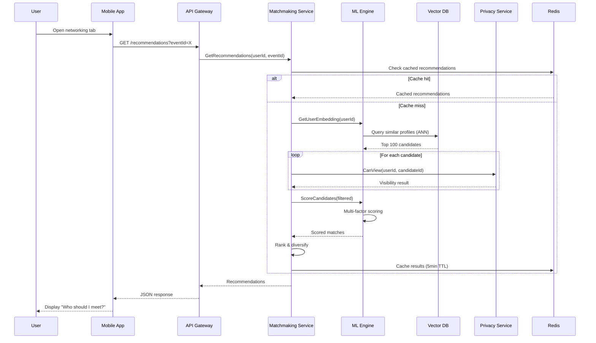
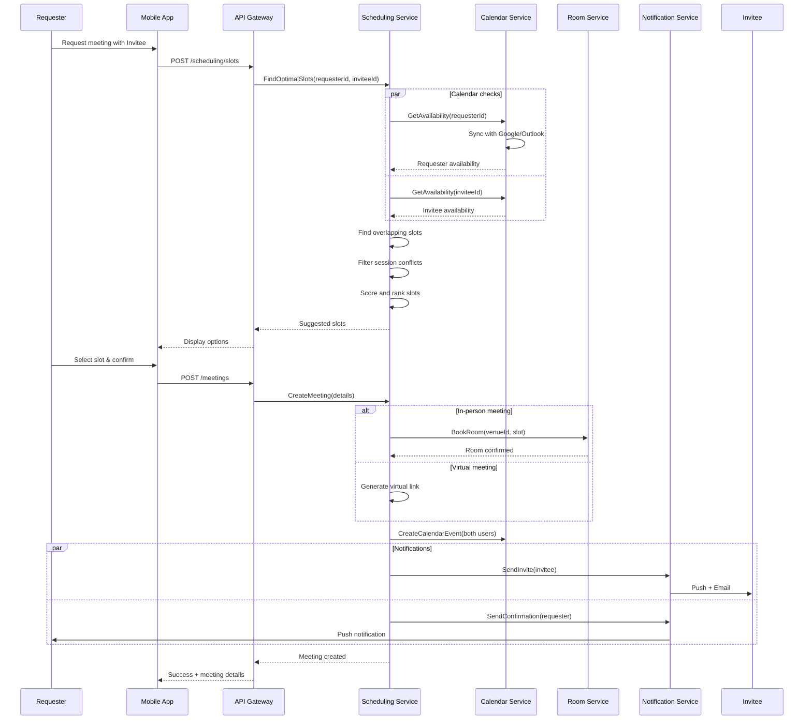
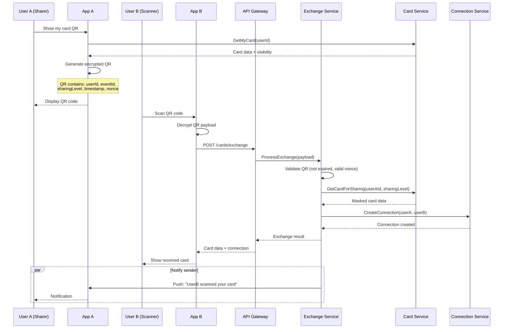

# ADR-005: Attendee Networking & Scheduling System

| Field | Value |
|-------|-------|
| **Status** | Proposed |
| **Date** | 2026-01-30 |
| **Decision Makers** | Architecture Team, Product Team |
| **Consulted** | Engineering, AI/ML Team, Privacy/Legal |
| **Informed** | All stakeholders |

---

## Context

Konferenco aims to maximize attendee value through meaningful connections. Traditional conference networking is often:

- **Random and inefficient**: Attendees struggle to find relevant people among thousands
- **Time-constrained**: Limited opportunities for scheduling meaningful conversations
- **Lost after the event**: Connections made at events fade without follow-up systems
- **Privacy-invasive**: Attendees often cannot control who can contact them
- **Lacking intelligence**: No AI-driven recommendations or matchmaking

Modern attendees expect intelligent networking features that:
1. Proactively suggest valuable connections based on interests and goals
2. Streamline meeting scheduling with calendar integration
3. Provide multiple connection methods (digital cards, QR, NFC)
4. Respect privacy preferences at granular levels
5. Continue nurturing relationships post-event
6. Gamify networking to encourage participation

The networking system must handle:
- **Scale**: Up to 180,000+ attendees at large conferences
- **Real-time**: Live matchmaking during sessions and breaks
- **Privacy**: GDPR/CCPA compliance with granular controls
- **Hybrid**: Both in-person and virtual networking scenarios
- **Integration**: CRM systems, calendars, communication tools

---

## Decision

We adopt an **AI-Driven Networking Platform** with the following components:

1. **ML-powered matchmaking engine** using embeddings and collaborative filtering
2. **Intelligent scheduling service** with calendar federation
3. **Multi-modal connection exchange** (QR, NFC, digital cards)
4. **Privacy-first architecture** with consent management
5. **Gamification engine** for engagement incentives
6. **Post-event CRM integration** for relationship continuity

### High-Level Architecture

```mermaid
graph TB
    subgraph "Client Layer"
        WEB[Web Application]
        MOBILE[Mobile App]
        BADGE[Smart Badge<br/>NFC-enabled]
        KIOSK[Networking Kiosks]
    end

    subgraph "API Gateway"
        GATEWAY[API Gateway]
        RATE[Rate Limiter]
        AUTH[Auth Filter]
    end

    subgraph "Networking Services"
        subgraph "Matchmaking Domain"
            MATCH_SVC[Matchmaking Service]
            ML_ENGINE[ML Engine<br/>Recommendations]
            EMBED_SVC[Embedding Service<br/>Profile Vectors]
        end

        subgraph "Scheduling Domain"
            SCHED_SVC[Scheduling Service]
            CAL_SVC[Calendar Service]
            ROOM_SVC[Room Booking Service]
            VIRTUAL_SVC[Virtual Meeting Service]
        end

        subgraph "Connection Domain"
            CONN_SVC[Connection Service]
            CARD_SVC[Digital Card Service]
            EXCHANGE_SVC[Exchange Service]
        end

        subgraph "Engagement Domain"
            GAME_SVC[Gamification Service]
            ACHIEVE_SVC[Achievement Service]
            REWARD_SVC[Reward Service]
        end

        subgraph "Privacy Domain"
            PRIVACY_SVC[Privacy Service]
            CONSENT_SVC[Consent Manager]
            VISIBILITY_SVC[Visibility Service]
        end

        subgraph "Follow-up Domain"
            FOLLOWUP_SVC[Follow-up Service]
            CRM_SVC[CRM Integration]
            NURTURE_SVC[Nurture Campaign Service]
        end
    end

    subgraph "AI/ML Infrastructure"
        VECTOR_DB[(Vector Database<br/>Pinecone/Milvus)]
        MODEL_SVC[Model Serving<br/>TensorFlow Serving]
        FEATURE_STORE[Feature Store<br/>Feast]
    end

    subgraph "Data Layer"
        POSTGRES[(PostgreSQL<br/>Profiles, Connections)]
        REDIS[(Redis<br/>Real-time State)]
        ELASTIC[(Elasticsearch<br/>Search & Discovery)]
        TIMESCALE[(TimescaleDB<br/>Interaction Analytics)]
    end

    subgraph "External Integrations"
        GCAL[Google Calendar]
        OUTLOOK[Microsoft 365]
        ZOOM[Zoom]
        TEAMS[MS Teams]
        SALESFORCE[Salesforce]
        HUBSPOT[HubSpot]
    end

    WEB --> GATEWAY
    MOBILE --> GATEWAY
    BADGE --> EXCHANGE_SVC
    KIOSK --> GATEWAY

    GATEWAY --> AUTH
    AUTH --> MATCH_SVC
    AUTH --> SCHED_SVC
    AUTH --> CONN_SVC
    AUTH --> GAME_SVC

    MATCH_SVC --> ML_ENGINE
    ML_ENGINE --> VECTOR_DB
    ML_ENGINE --> MODEL_SVC
    ML_ENGINE --> FEATURE_STORE
    MATCH_SVC --> EMBED_SVC

    SCHED_SVC --> CAL_SVC
    SCHED_SVC --> ROOM_SVC
    SCHED_SVC --> VIRTUAL_SVC
    CAL_SVC --> GCAL
    CAL_SVC --> OUTLOOK
    VIRTUAL_SVC --> ZOOM
    VIRTUAL_SVC --> TEAMS

    CONN_SVC --> CARD_SVC
    CONN_SVC --> EXCHANGE_SVC
    CONN_SVC --> PRIVACY_SVC

    PRIVACY_SVC --> CONSENT_SVC
    PRIVACY_SVC --> VISIBILITY_SVC

    FOLLOWUP_SVC --> CRM_SVC
    CRM_SVC --> SALESFORCE
    CRM_SVC --> HUBSPOT
    FOLLOWUP_SVC --> NURTURE_SVC

    MATCH_SVC --> POSTGRES
    CONN_SVC --> POSTGRES
    SCHED_SVC --> POSTGRES
    GAME_SVC --> POSTGRES

    MATCH_SVC --> REDIS
    SCHED_SVC --> REDIS

    MATCH_SVC --> ELASTIC
    CONN_SVC --> ELASTIC

    GAME_SVC --> TIMESCALE
```



### Component Architecture

#### 1. AI-Powered Matchmaking Service

```yaml
matchmaking_service:
  name: "Matchmaking Service"
  bounded_context: "Intelligent Networking"
  technology:
    language: "Python"
    framework: "FastAPI"
    ml_framework: "PyTorch"
    runtime: "Python 3.12"

  responsibilities:
    - Profile vectorization and embedding generation
    - Interest-based matching algorithms
    - Goal alignment scoring
    - Mutual interest detection
    - Real-time recommendation updates
    - Warm introduction facilitation

  interfaces:
    graphql:
      - Query: recommendations, matches, whoShouldIMeet, mutualConnections
      - Mutation: updatePreferences, requestIntroduction, dismissRecommendation

    grpc:
      - GetRecommendations(userId, context) -> RecommendationList
      - ComputeMatchScore(userA, userB) -> MatchScore
      - FindMutualInterests(userA, userB) -> InterestList

    events_published:
      - recommendation.generated
      - match.found
      - introduction.requested
      - introduction.accepted
      - mutual_interest.detected

    events_subscribed:
      - profile.updated
      - connection.made
      - session.attended
      - interaction.recorded

  ml_models:
    profile_embedding:
      architecture: "Transformer-based encoder"
      dimensions: 768
      training_data: "Professional profiles, interests, goals"
      update_frequency: "Weekly retraining"

    match_scorer:
      architecture: "Neural collaborative filtering"
      features:
        - Profile similarity (cosine)
        - Interest overlap (Jaccard)
        - Goal alignment (semantic)
        - Interaction history
        - Network proximity
      output: "Match probability [0-1]"

    introduction_predictor:
      architecture: "Graph Neural Network"
      input: "Connection graph + profile features"
      output: "Warm introduction paths"

  data_model:
    primary_store: PostgreSQL
    vector_store: Pinecone
    cache: Redis (recommendations TTL: 5min)

  scaling:
    strategy: horizontal
    min_instances: 3
    max_instances: 30
    gpu_instances: 2-10 (for ML inference)
    scaling_triggers:
      - request_queue_depth > 100
      - inference_latency > 200ms
```

**Matching Algorithm Pseudocode:**

```python
class MatchmakingEngine:
    """
    AI-powered attendee matching using multi-factor scoring.
    Combines semantic similarity, network analysis, and behavioral signals.
    """

    def __init__(self, vector_db, graph_db, feature_store):
        self.vector_db = vector_db
        self.graph_db = graph_db
        self.feature_store = feature_store
        self.embedding_model = load_model("profile_encoder_v3")
        self.match_scorer = load_model("match_scorer_v2")

    async def get_recommendations(
        self,
        user_id: str,
        context: MatchContext,
        limit: int = 20
    ) -> list[Recommendation]:
        """
        Generate personalized networking recommendations.

        Algorithm:
        1. Retrieve user's profile embedding
        2. Find candidate matches via ANN search
        3. Filter by privacy/visibility settings
        4. Score matches using multi-factor model
        5. Rank and diversify results
        6. Add mutual connection context
        """
        # Step 1: Get user profile embedding
        user_embedding = await self.get_or_compute_embedding(user_id)
        user_features = await self.feature_store.get_features(user_id)

        # Step 2: Approximate Nearest Neighbor search
        candidates = await self.vector_db.query(
            vector=user_embedding,
            top_k=limit * 5,  # Over-fetch for filtering
            filter={
                "event_id": context.event_id,
                "is_visible": True,
                "is_available": True
            }
        )

        # Step 3: Apply privacy filters
        visible_candidates = await self.filter_by_privacy(
            user_id=user_id,
            candidates=candidates,
            context=context
        )

        # Step 4: Multi-factor scoring
        scored_matches = []
        for candidate in visible_candidates:
            score = await self.compute_match_score(
                user_features=user_features,
                candidate_features=candidate.features,
                context=context
            )
            scored_matches.append((candidate, score))

        # Step 5: Rank and diversify
        ranked = self.rank_with_diversity(
            matches=scored_matches,
            diversity_factors=["industry", "role", "company_size"]
        )

        # Step 6: Enrich with mutual connections
        recommendations = []
        for candidate, score in ranked[:limit]:
            mutual = await self.find_mutual_connections(user_id, candidate.id)
            warm_intro_path = await self.find_warm_intro_path(user_id, candidate.id)

            recommendations.append(Recommendation(
                user=candidate,
                match_score=score,
                mutual_connections=mutual,
                warm_intro_available=warm_intro_path is not None,
                reasons=self.explain_match(user_features, candidate.features)
            ))

        return recommendations

    async def compute_match_score(
        self,
        user_features: UserFeatures,
        candidate_features: UserFeatures,
        context: MatchContext
    ) -> MatchScore:
        """
        Multi-factor match scoring combining:
        - Semantic similarity (profile embeddings)
        - Interest overlap (explicit interests)
        - Goal alignment (what they're looking for)
        - Network proximity (shared connections)
        - Behavioral signals (interaction patterns)
        """
        scores = {}

        # Semantic similarity via embeddings
        scores["semantic"] = cosine_similarity(
            user_features.embedding,
            candidate_features.embedding
        )

        # Interest overlap (Jaccard index)
        shared_interests = set(user_features.interests) & set(candidate_features.interests)
        all_interests = set(user_features.interests) | set(candidate_features.interests)
        scores["interest_overlap"] = len(shared_interests) / max(len(all_interests), 1)

        # Goal alignment
        scores["goal_alignment"] = self.score_goal_alignment(
            seeker_goals=user_features.networking_goals,
            provider_capabilities=candidate_features.expertise
        )

        # Network proximity (2nd/3rd degree connections)
        scores["network_proximity"] = await self.graph_db.compute_proximity(
            user_features.id,
            candidate_features.id
        )

        # Behavioral compatibility
        scores["behavioral"] = self.score_behavioral_compatibility(
            user_features.interaction_style,
            candidate_features.interaction_style
        )

        # Context-aware boosting
        if context.session_id:
            # Boost attendees of same session
            if candidate_features.id in context.session_attendees:
                scores["context_boost"] = 0.2

        # Weighted combination
        weights = {
            "semantic": 0.25,
            "interest_overlap": 0.20,
            "goal_alignment": 0.25,
            "network_proximity": 0.15,
            "behavioral": 0.10,
            "context_boost": 0.05
        }

        final_score = sum(
            scores.get(k, 0) * v for k, v in weights.items()
        )

        return MatchScore(
            total=final_score,
            breakdown=scores,
            confidence=self.compute_confidence(scores)
        )

    def score_goal_alignment(
        self,
        seeker_goals: list[NetworkingGoal],
        provider_capabilities: list[Expertise]
    ) -> float:
        """
        Score how well a candidate can fulfill user's networking goals.

        Examples:
        - User seeks "mentorship in AI" -> Candidate has "10 years ML experience"
        - User seeks "business partnership" -> Candidate is "looking for partners"
        """
        alignment_scores = []

        for goal in seeker_goals:
            best_match = 0.0
            for capability in provider_capabilities:
                # Semantic similarity between goal and capability
                similarity = self.embedding_model.similarity(
                    goal.description,
                    capability.description
                )

                # Experience level bonus
                if capability.years_experience >= goal.min_experience:
                    similarity *= 1.2

                best_match = max(best_match, similarity)

            alignment_scores.append(best_match)

        return sum(alignment_scores) / max(len(alignment_scores), 1)
```

#### 2. Meeting Scheduling Service

```yaml
scheduling_service:
  name: "Meeting Scheduling Service"
  bounded_context: "Calendar & Meetings"
  technology:
    language: "TypeScript"
    framework: "NestJS"
    runtime: "Node.js 22"

  responsibilities:
    - Calendar integration (Google, Outlook, Apple)
    - Availability detection and slot finding
    - Meeting room/venue booking
    - Virtual meeting room provisioning
    - Buffer time management
    - Conflict resolution
    - Timezone handling

  interfaces:
    graphql:
      - Query: availability, suggestedSlots, myMeetings, roomAvailability
      - Mutation: requestMeeting, acceptMeeting, rescheduleMeeting, cancelMeeting

    events_published:
      - meeting.requested
      - meeting.accepted
      - meeting.declined
      - meeting.rescheduled
      - meeting.cancelled
      - meeting.reminder
      - meeting.started
      - meeting.ended

    events_subscribed:
      - user.calendar.synced
      - session.scheduled
      - room.status.changed

  calendar_integrations:
    google_calendar:
      auth: OAuth 2.0
      scopes: ["calendar.events", "calendar.readonly"]
      sync_mode: "bidirectional"
      webhook_support: true

    microsoft_365:
      auth: "Microsoft Graph API"
      scopes: ["Calendars.ReadWrite"]
      sync_mode: "bidirectional"
      webhook_support: true

    apple_calendar:
      auth: "CalDAV"
      sync_mode: "read-only"

  scheduling_rules:
    buffer_times:
      default: 15  # minutes between meetings
      walking_distance: 10  # extra minutes for venue changes
      virtual: 5  # shorter buffer for virtual

    constraints:
      min_notice: 30  # minutes
      max_advance: 90  # days
      max_duration: 120  # minutes
      daily_meeting_limit: 8

    smart_suggestions:
      prefer_breaks: true  # suggest during natural breaks
      avoid_keynotes: true  # don't overlap with main events
      cluster_meetings: true  # group meetings geographically
```

**Scheduling Algorithm:**

```typescript
interface SchedulingEngine {
  /**
   * Find optimal meeting slots considering multiple factors:
   * - Both parties' calendar availability
   * - Event schedule (avoid conflicts with sessions)
   * - Venue logistics (meeting rooms, walking distance)
   * - Buffer times and fatigue management
   * - Timezone differences for virtual meetings
   */
  findOptimalSlots(
    requesterId: string,
    inviteeId: string,
    preferences: MeetingPreferences
  ): Promise<SuggestedSlot[]>;
}

class SmartScheduler implements SchedulingEngine {
  constructor(
    private calendarService: CalendarService,
    private venueService: VenueService,
    private eventSchedule: EventScheduleService
  ) {}

  async findOptimalSlots(
    requesterId: string,
    inviteeId: string,
    preferences: MeetingPreferences
  ): Promise<SuggestedSlot[]> {
    const { eventId, duration, meetingType, dateRange } = preferences;

    // Step 1: Get both users' availability
    const [requesterCal, inviteeCal] = await Promise.all([
      this.calendarService.getAvailability(requesterId, dateRange),
      this.calendarService.getAvailability(inviteeId, dateRange)
    ]);

    // Step 2: Find overlapping free slots
    const overlappingSlots = this.findOverlappingSlots(
      requesterCal,
      inviteeCal,
      duration
    );

    // Step 3: Filter out event session conflicts
    const eventSchedule = await this.eventSchedule.getSchedule(eventId, dateRange);
    const nonConflictingSlots = overlappingSlots.filter(slot =>
      !this.conflictsWithMustAttend(slot, eventSchedule, [requesterId, inviteeId])
    );

    // Step 4: Score and rank slots
    const scoredSlots = await Promise.all(
      nonConflictingSlots.map(async (slot) => ({
        slot,
        score: await this.scoreSlot(slot, preferences, eventSchedule)
      }))
    );

    // Step 5: Apply venue/room constraints if in-person
    let finalSlots = scoredSlots;
    if (meetingType === 'in-person') {
      finalSlots = await this.filterByVenueAvailability(
        scoredSlots,
        eventId,
        preferences.preferredVenue
      );
    }

    // Step 6: Return top suggestions
    return finalSlots
      .sort((a, b) => b.score - a.score)
      .slice(0, 5)
      .map(({ slot, score }) => ({
        startTime: slot.start,
        endTime: slot.end,
        score,
        venue: slot.venue,
        virtualLink: meetingType === 'virtual' ? this.generateVirtualLink() : null,
        reasoning: this.explainSlotScore(slot, score)
      }));
  }

  private async scoreSlot(
    slot: TimeSlot,
    preferences: MeetingPreferences,
    eventSchedule: EventSchedule
  ): Promise<number> {
    let score = 1.0;

    // Prefer natural break times (lunch, coffee breaks)
    if (this.isDuringBreak(slot, eventSchedule)) {
      score *= 1.3;
    }

    // Penalize early morning / late evening
    const hour = slot.start.getHours();
    if (hour < 9 || hour > 18) {
      score *= 0.7;
    }

    // Boost if slot allows attending interesting sessions before/after
    const sessionsNearby = this.getSessionsNearSlot(slot, eventSchedule);
    if (sessionsNearby.length > 0) {
      score *= 1.1;
    }

    // Consider user's meeting fatigue
    const meetingsToday = await this.getMeetingCount(
      preferences.requesterId,
      slot.start
    );
    if (meetingsToday >= 6) {
      score *= 0.6; // Heavy penalty for overbooked days
    }

    // Timezone convenience for virtual meetings
    if (preferences.meetingType === 'virtual') {
      const tzDiff = this.getTimezoneDifference(
        preferences.requesterTz,
        preferences.inviteeTz
      );
      if (tzDiff > 8) {
        score *= 0.5; // Significant timezone difference
      }
    }

    return score;
  }
}
```

#### 3. Connection Exchange Service

```yaml
connection_exchange_service:
  name: "Connection Exchange Service"
  bounded_context: "Digital Networking"
  technology:
    language: "TypeScript"
    framework: "NestJS"
    runtime: "Node.js 22"

  responsibilities:
    - Digital business card management
    - QR code generation and scanning
    - NFC tap-to-connect handling
    - Profile sharing with visibility controls
    - Connection request management

  interfaces:
    graphql:
      - Query: myCard, myConnections, pendingRequests, connectionHistory
      - Mutation: createCard, updateCard, shareCard, connect, acceptConnection

    rest:
      - GET /card/{userId}/qr - Generate QR code
      - POST /exchange/scan - Process scanned QR
      - POST /exchange/nfc - Handle NFC tap

    events_published:
      - card.created
      - card.updated
      - card.shared
      - connection.requested
      - connection.accepted
      - connection.declined
      - exchange.completed

  exchange_methods:
    qr_code:
      format: "Dynamic QR with encrypted payload"
      expiry: "5 minutes"
      data:
        - user_id
        - event_id
        - timestamp
        - nonce
        - sharing_level
      encryption: "AES-256-GCM"

    nfc:
      protocol: "NDEF"
      hardware: "Smart badges / phone NFC"
      range: "4cm max"
      data_exchange:
        - profile_link
        - vcard_payload
        - mutual_connection_hint

    digital_card:
      formats: ["vCard 4.0", "JSON", "PDF"]
      fields:
        required: [name, email]
        optional: [phone, title, company, linkedin, twitter, bio, photo]
      sharing_levels:
        minimal: [name, title, company]
        standard: [name, email, title, company, linkedin]
        full: [all_fields]
```

**Digital Card Schema:**

```typescript
interface DigitalBusinessCard {
  id: string;
  userId: string;
  eventId?: string;

  // Core identity
  name: {
    first: string;
    last: string;
    display: string;
    pronunciation?: string;
  };

  // Professional info
  title: string;
  company: string;
  department?: string;

  // Contact methods (visibility controlled)
  contact: {
    email: ContactField;
    phone?: ContactField;
    website?: ContactField;
  };

  // Social profiles
  social: {
    linkedin?: SocialProfile;
    twitter?: SocialProfile;
    github?: SocialProfile;
    custom?: SocialProfile[];
  };

  // Media
  photo?: {
    url: string;
    thumbnail: string;
  };
  logo?: string;

  // Networking context
  networkingGoals?: string[];
  lookingFor?: string[];
  offering?: string[];

  // Visibility settings
  visibility: {
    default: SharingLevel;
    perField: Record<string, SharingLevel>;
  };

  // Branding
  style?: {
    primaryColor: string;
    template: string;
  };

  // Metadata
  createdAt: Date;
  updatedAt: Date;
  version: number;
}

interface ContactField {
  value: string;
  visibility: SharingLevel;
  verified: boolean;
}

type SharingLevel = 'public' | 'connections' | 'mutual' | 'request' | 'private';
```

#### 4. Privacy & Consent Service

```yaml
privacy_service:
  name: "Privacy & Consent Service"
  bounded_context: "Privacy Management"
  technology:
    language: "TypeScript"
    framework: "NestJS"
    runtime: "Node.js 22"

  responsibilities:
    - Visibility settings management
    - Do-not-disturb mode handling
    - Selective sharing controls
    - Consent tracking and audit
    - Data retention policy enforcement
    - GDPR/CCPA compliance

  interfaces:
    graphql:
      - Query: myPrivacySettings, visibilityPreferences, consentHistory
      - Mutation: updateVisibility, setDoNotDisturb, grantConsent, revokeConsent

    events_published:
      - privacy.settings.updated
      - visibility.changed
      - dnd.activated
      - dnd.deactivated
      - consent.granted
      - consent.revoked
      - data.retention.expired

  privacy_controls:
    visibility_levels:
      - public: "Visible to all event attendees"
      - connections_only: "Only my connections"
      - mutual_connections: "Connections of connections"
      - approved_only: "Must approve each view"
      - invisible: "Not discoverable"

    do_not_disturb:
      modes:
        - off: "Available for networking"
        - soft: "Receive requests, no notifications"
        - hard: "Block all networking features"
        - scheduled: "DND during specific hours"

      auto_triggers:
        - during_keynotes: true
        - low_battery: optional
        - focus_mode: optional

    data_retention:
      connection_requests: "30 days if not accepted"
      declined_requests: "7 days"
      chat_history: "Event duration + 90 days"
      analytics_data: "2 years (anonymized after 1 year)"
      personal_data: "On request (GDPR Art. 17)"

  compliance:
    gdpr:
      - Explicit consent for data processing
      - Right to access (data export)
      - Right to erasure (delete all data)
      - Data portability (export connections)
      - Consent withdrawal

    ccpa:
      - Do not sell option
      - Opt-out of profiling
      - Data disclosure requests
```

**Privacy Enforcement:**

```typescript
class PrivacyEnforcementService {
  /**
   * Check if user A can view user B's profile/card.
   * Implements layered visibility checks.
   */
  async canView(
    viewerId: string,
    targetId: string,
    context: ViewContext
  ): Promise<VisibilityResult> {
    // Get target's privacy settings
    const settings = await this.getPrivacySettings(targetId);

    // Check DND status first
    if (await this.isInDoNotDisturb(targetId)) {
      return {
        allowed: false,
        reason: 'do_not_disturb',
        retryAfter: await this.getDndEndTime(targetId)
      };
    }

    // Check visibility level
    const visibility = settings.discoverability;

    switch (visibility) {
      case 'public':
        return { allowed: true, visibleFields: settings.publicFields };

      case 'connections_only':
        const isConnected = await this.connectionService.areConnected(
          viewerId,
          targetId
        );
        if (isConnected) {
          return { allowed: true, visibleFields: settings.connectionFields };
        }
        return { allowed: false, reason: 'not_connected' };

      case 'mutual_connections':
        const hasMutual = await this.connectionService.haveMutualConnections(
          viewerId,
          targetId
        );
        if (hasMutual) {
          return { allowed: true, visibleFields: settings.mutualFields };
        }
        return { allowed: false, reason: 'no_mutual_connections' };

      case 'approved_only':
        const isApproved = await this.approvalService.isApproved(
          viewerId,
          targetId
        );
        if (isApproved) {
          return { allowed: true, visibleFields: settings.approvedFields };
        }
        return {
          allowed: false,
          reason: 'approval_required',
          canRequest: true
        };

      case 'invisible':
        return { allowed: false, reason: 'invisible' };

      default:
        return { allowed: false, reason: 'unknown_visibility' };
    }
  }

  /**
   * Filter a list of recommendations based on privacy settings.
   * Removes users who should not be visible to the requester.
   */
  async filterByPrivacy(
    viewerId: string,
    candidates: UserProfile[],
    context: ViewContext
  ): Promise<FilteredProfile[]> {
    const results = await Promise.all(
      candidates.map(async (candidate) => {
        const visibility = await this.canView(viewerId, candidate.id, context);

        if (!visibility.allowed) {
          return null;
        }

        // Mask fields based on visibility level
        return {
          ...this.maskFields(candidate, visibility.visibleFields),
          connectionPath: visibility.connectionPath
        };
      })
    );

    return results.filter(Boolean);
  }

  /**
   * Handle GDPR data export request.
   */
  async exportUserData(userId: string): Promise<DataExport> {
    const data = await Promise.all([
      this.profileService.getFullProfile(userId),
      this.connectionService.getAllConnections(userId),
      this.meetingService.getAllMeetings(userId),
      this.interactionService.getAllInteractions(userId),
      this.consentService.getConsentHistory(userId)
    ]);

    return {
      format: 'json',
      generatedAt: new Date(),
      data: {
        profile: data[0],
        connections: data[1],
        meetings: data[2],
        interactions: data[3],
        consents: data[4]
      },
      retentionPolicy: await this.getRetentionPolicy(userId)
    };
  }
}
```

#### 5. Gamification Service

```yaml
gamification_service:
  name: "Gamification Service"
  bounded_context: "Engagement & Rewards"
  technology:
    language: "TypeScript"
    framework: "NestJS"
    runtime: "Node.js 22"

  responsibilities:
    - Achievement tracking and awarding
    - Networking milestone management
    - Points and XP calculation
    - Leaderboard management
    - Reward distribution
    - Badge system

  interfaces:
    graphql:
      - Query: myAchievements, leaderboard, availableRewards, progress
      - Mutation: claimReward, shareAchievement

    events_published:
      - achievement.unlocked
      - milestone.reached
      - points.earned
      - reward.claimed
      - leaderboard.updated

    events_subscribed:
      - connection.made
      - meeting.completed
      - session.attended
      - card.exchanged
      - introduction.successful

  achievement_categories:
    connector:
      - first_connection: "Make your first connection"
      - network_builder: "Connect with 10 people"
      - super_connector: "Connect with 50 people"
      - networking_maven: "Connect with 100 people"

    scheduler:
      - first_meeting: "Schedule your first meeting"
      - busy_bee: "Have 5 meetings in one day"
      - time_optimizer: "No scheduling conflicts for entire event"

    introducer:
      - matchmaker: "Successfully introduce two people"
      - bridge_builder: "Make 10 successful introductions"
      - community_catalyst: "Introductions lead to 5 collaborations"

    explorer:
      - diverse_networker: "Connect across 5 different industries"
      - global_citizen: "Connect with people from 10 countries"
      - role_ranger: "Connect with C-suite, manager, and IC levels"

    engager:
      - conversation_starter: "Send first message to 10 connections"
      - follow_up_pro: "Follow up with all meetings within 24 hours"
      - relationship_builder: "Maintain contact for 3 months post-event"

  points_system:
    actions:
      connection_made: 10
      meeting_scheduled: 15
      meeting_completed: 25
      introduction_made: 20
      introduction_successful: 50
      card_exchanged: 5
      profile_completed: 30
      session_networking: 15

    multipliers:
      streak_bonus: 1.5  # 3+ days consecutive activity
      quality_connection: 2.0  # Connection leads to follow-up
      cross_industry: 1.3  # Diverse networking
      first_timer_help: 1.5  # Helping newcomers

  leaderboards:
    types:
      - overall: "Total points"
      - connections: "Most connections"
      - meetings: "Most meetings"
      - introductions: "Most successful intros"
      - diversity: "Most diverse network"

    refresh_rate: "Real-time with 1-minute cache"
    privacy:
      opt_in_required: true
      anonymous_option: true
      rank_visibility: "top_100_only"

  rewards:
    virtual:
      - exclusive_content: "Access to speaker Q&A"
      - vip_access: "VIP lounge access"
      - priority_scheduling: "Priority meeting room booking"

    physical:
      - swag: "Conference merchandise"
      - upgrades: "Seat upgrades for keynotes"
      - certificates: "Networking achievement certificates"

    redemption:
      points_to_reward_ratio: "100:1"
      expiry: "End of event + 30 days"
```

**Achievement Engine:**

```typescript
class AchievementEngine {
  private achievementRules: Map<string, AchievementRule>;

  constructor() {
    this.initializeRules();
  }

  /**
   * Process an event and check for achievement unlocks.
   */
  async processEvent(
    userId: string,
    event: NetworkingEvent
  ): Promise<UnlockedAchievement[]> {
    const userProgress = await this.getProgress(userId);
    const unlocked: UnlockedAchievement[] = [];

    // Update progress based on event type
    const updatedProgress = this.updateProgress(userProgress, event);

    // Check all applicable rules
    for (const [achievementId, rule] of this.achievementRules) {
      if (userProgress.achieved.has(achievementId)) {
        continue; // Already unlocked
      }

      if (rule.evaluate(updatedProgress, event)) {
        const achievement = await this.unlockAchievement(
          userId,
          achievementId,
          event
        );
        unlocked.push(achievement);

        // Award points
        await this.awardPoints(userId, rule.points, event);
      }
    }

    // Check for milestone achievements
    const milestones = await this.checkMilestones(userId, updatedProgress);
    unlocked.push(...milestones);

    // Persist updated progress
    await this.saveProgress(userId, updatedProgress);

    return unlocked;
  }

  /**
   * Calculate points with multipliers.
   */
  private calculatePoints(
    basePoints: number,
    event: NetworkingEvent,
    userContext: UserContext
  ): number {
    let points = basePoints;

    // Streak bonus
    if (userContext.consecutiveDays >= 3) {
      points *= 1.5;
    }

    // Cross-industry bonus
    if (event.type === 'connection' &&
        event.data.crossIndustry) {
      points *= 1.3;
    }

    // Helping newcomers bonus
    if (event.type === 'connection' &&
        event.data.targetIsFirstTimer) {
      points *= 1.5;
    }

    // Quality connection bonus
    if (event.type === 'meeting_completed' &&
        event.data.followUpScheduled) {
      points *= 2.0;
    }

    return Math.round(points);
  }

  /**
   * Update leaderboard rankings.
   */
  async updateLeaderboard(
    eventId: string,
    category: LeaderboardCategory
  ): Promise<void> {
    const rankings = await this.computeRankings(eventId, category);

    // Detect rank changes for notifications
    const previousRankings = await this.cache.get(
      `leaderboard:${eventId}:${category}`
    );

    const changes = this.detectRankChanges(previousRankings, rankings);

    // Notify users of significant rank changes
    for (const change of changes) {
      if (change.movedUp && change.newRank <= 10) {
        await this.notificationService.send(change.userId, {
          type: 'leaderboard_rank_up',
          category,
          oldRank: change.oldRank,
          newRank: change.newRank
        });
      }
    }

    // Cache new rankings
    await this.cache.set(
      `leaderboard:${eventId}:${category}`,
      rankings,
      { ttl: 60 } // 1 minute cache
    );
  }
}
```

#### 6. Follow-up & CRM Integration Service

```yaml
followup_service:
  name: "Follow-up Service"
  bounded_context: "Relationship Continuity"
  technology:
    language: "TypeScript"
    framework: "NestJS"
    runtime: "Node.js 22"

  responsibilities:
    - Post-event connection nurturing
    - CRM synchronization
    - Action item tracking
    - Relationship health scoring
    - Automated follow-up reminders

  interfaces:
    graphql:
      - Query: actionItems, relationshipHealth, syncStatus, nurtureCampaigns
      - Mutation: createActionItem, completeActionItem, syncToCRM, startNurture

    events_published:
      - action_item.created
      - action_item.completed
      - action_item.overdue
      - crm.sync.completed
      - nurture.campaign.started
      - relationship.score.changed

  crm_integrations:
    salesforce:
      objects:
        - Contact
        - Lead
        - Task
        - Event
        - Campaign
      sync_mode: "bidirectional"
      field_mapping: "configurable"
      conflict_resolution: "crm_wins"

    hubspot:
      objects:
        - Contact
        - Deal
        - Task
        - Meeting
        - Note
      sync_mode: "bidirectional"
      field_mapping: "configurable"

    custom_crm:
      protocol: "REST/GraphQL webhook"
      authentication: "OAuth 2.0 / API Key"

  nurture_campaigns:
    templates:
      post_event_thank_you:
        trigger: "event.ended"
        delay: "24 hours"
        content: "Thank you for connecting at {event_name}"

      meeting_follow_up:
        trigger: "meeting.completed"
        delay: "2 hours"
        content: "Great meeting you! Here are the action items we discussed..."

      dormant_connection:
        trigger: "no_interaction > 30 days"
        content: "It's been a while! Would you like to catch up?"

      introduction_follow_up:
        trigger: "introduction.made + 7 days"
        content: "How did your conversation with {introduced_person} go?"

  relationship_health:
    factors:
      - last_interaction_days
      - interaction_frequency
      - response_rate
      - meeting_completion_rate
      - mutual_engagement

    scores:
      strong: "> 80"
      healthy: "60-80"
      needs_attention: "40-60"
      at_risk: "< 40"

    auto_actions:
      at_risk:
        - create_reminder
        - suggest_touchpoint
        - recommend_content_to_share
```

### Data Architecture

```sql
-- Core Networking Tables

-- User networking profile (extends base user)
CREATE TABLE networking_profiles (
    id UUID PRIMARY KEY DEFAULT gen_random_uuid(),
    user_id UUID NOT NULL REFERENCES users(id) ON DELETE CASCADE,
    event_id UUID NOT NULL REFERENCES events(id) ON DELETE CASCADE,

    -- Networking goals
    goals JSONB NOT NULL DEFAULT '[]',
    looking_for TEXT[],
    offering TEXT[],

    -- Interests for matching
    interests TEXT[] NOT NULL DEFAULT '{}',
    expertise TEXT[] NOT NULL DEFAULT '{}',

    -- Embedding for ML matching
    profile_embedding VECTOR(768),
    embedding_version INTEGER DEFAULT 1,

    -- Availability preferences
    availability_preferences JSONB,
    meeting_preferences JSONB,

    -- Privacy settings
    visibility VARCHAR(50) DEFAULT 'public',
    do_not_disturb BOOLEAN DEFAULT FALSE,
    dnd_until TIMESTAMPTZ,

    created_at TIMESTAMPTZ DEFAULT NOW(),
    updated_at TIMESTAMPTZ DEFAULT NOW(),

    UNIQUE(user_id, event_id),
    INDEX idx_event_visibility (event_id, visibility),
    INDEX idx_embedding (profile_embedding) USING ivfflat
);

-- Connections between users
CREATE TABLE connections (
    id UUID PRIMARY KEY DEFAULT gen_random_uuid(),
    requester_id UUID NOT NULL REFERENCES users(id),
    accepter_id UUID NOT NULL REFERENCES users(id),
    event_id UUID REFERENCES events(id),

    status VARCHAR(50) NOT NULL DEFAULT 'pending',
    -- pending, accepted, declined, blocked

    connection_type VARCHAR(50) DEFAULT 'professional',
    -- professional, mentorship, collaboration, social

    exchange_method VARCHAR(50),
    -- qr_scan, nfc_tap, search, recommendation, introduction

    introducer_id UUID REFERENCES users(id),

    notes TEXT,
    tags TEXT[],

    requested_at TIMESTAMPTZ DEFAULT NOW(),
    responded_at TIMESTAMPTZ,

    CHECK (requester_id != accepter_id),
    UNIQUE(requester_id, accepter_id),
    INDEX idx_user_connections (requester_id, status),
    INDEX idx_user_connections_2 (accepter_id, status),
    INDEX idx_event_connections (event_id, status)
);

-- Scheduled meetings
CREATE TABLE meetings (
    id UUID PRIMARY KEY DEFAULT gen_random_uuid(),
    event_id UUID REFERENCES events(id),

    organizer_id UUID NOT NULL REFERENCES users(id),

    title VARCHAR(255) NOT NULL,
    description TEXT,

    meeting_type VARCHAR(50) NOT NULL,
    -- in_person, virtual, hybrid

    start_time TIMESTAMPTZ NOT NULL,
    end_time TIMESTAMPTZ NOT NULL,
    timezone VARCHAR(50) NOT NULL,

    -- Location details
    venue_id UUID REFERENCES venues(id),
    room_id UUID REFERENCES meeting_rooms(id),
    virtual_link VARCHAR(500),
    virtual_provider VARCHAR(50),

    status VARCHAR(50) DEFAULT 'scheduled',
    -- scheduled, confirmed, in_progress, completed, cancelled, no_show

    -- Calendar sync
    external_calendar_id VARCHAR(255),
    calendar_provider VARCHAR(50),

    created_at TIMESTAMPTZ DEFAULT NOW(),
    updated_at TIMESTAMPTZ DEFAULT NOW(),

    INDEX idx_organizer_meetings (organizer_id, start_time),
    INDEX idx_event_meetings (event_id, start_time),
    INDEX idx_room_meetings (room_id, start_time, end_time)
);

-- Meeting participants
CREATE TABLE meeting_participants (
    meeting_id UUID NOT NULL REFERENCES meetings(id) ON DELETE CASCADE,
    user_id UUID NOT NULL REFERENCES users(id),

    status VARCHAR(50) DEFAULT 'invited',
    -- invited, accepted, declined, tentative

    role VARCHAR(50) DEFAULT 'attendee',
    -- organizer, attendee

    responded_at TIMESTAMPTZ,
    attended BOOLEAN,

    PRIMARY KEY (meeting_id, user_id),
    INDEX idx_user_meetings (user_id, status)
);

-- Digital business cards
CREATE TABLE digital_cards (
    id UUID PRIMARY KEY DEFAULT gen_random_uuid(),
    user_id UUID NOT NULL REFERENCES users(id) ON DELETE CASCADE,
    event_id UUID REFERENCES events(id),

    name JSONB NOT NULL,
    title VARCHAR(255),
    company VARCHAR(255),

    contact JSONB NOT NULL DEFAULT '{}',
    social JSONB DEFAULT '{}',

    photo_url VARCHAR(500),
    logo_url VARCHAR(500),

    networking_goals TEXT[],
    looking_for TEXT[],
    offering TEXT[],

    visibility_settings JSONB NOT NULL DEFAULT '{}',
    style JSONB DEFAULT '{}',

    is_default BOOLEAN DEFAULT FALSE,

    created_at TIMESTAMPTZ DEFAULT NOW(),
    updated_at TIMESTAMPTZ DEFAULT NOW(),

    INDEX idx_user_cards (user_id, is_default),
    INDEX idx_event_cards (event_id)
);

-- Card exchanges
CREATE TABLE card_exchanges (
    id UUID PRIMARY KEY DEFAULT gen_random_uuid(),

    sender_id UUID NOT NULL REFERENCES users(id),
    receiver_id UUID NOT NULL REFERENCES users(id),
    card_id UUID NOT NULL REFERENCES digital_cards(id),
    event_id UUID REFERENCES events(id),

    exchange_method VARCHAR(50) NOT NULL,
    -- qr_scan, nfc_tap, share_link, direct_send

    sharing_level VARCHAR(50) NOT NULL,
    -- minimal, standard, full

    location_context JSONB,

    exchanged_at TIMESTAMPTZ DEFAULT NOW(),

    INDEX idx_sender_exchanges (sender_id, exchanged_at),
    INDEX idx_receiver_exchanges (receiver_id, exchanged_at)
);

-- Achievements and gamification
CREATE TABLE user_achievements (
    id UUID PRIMARY KEY DEFAULT gen_random_uuid(),
    user_id UUID NOT NULL REFERENCES users(id) ON DELETE CASCADE,
    event_id UUID REFERENCES events(id),
    achievement_id VARCHAR(100) NOT NULL,

    unlocked_at TIMESTAMPTZ DEFAULT NOW(),
    trigger_event JSONB,
    points_awarded INTEGER NOT NULL DEFAULT 0,

    UNIQUE(user_id, event_id, achievement_id),
    INDEX idx_user_achievements (user_id, unlocked_at)
);

-- Points and leaderboard
CREATE TABLE user_points (
    id UUID PRIMARY KEY DEFAULT gen_random_uuid(),
    user_id UUID NOT NULL REFERENCES users(id) ON DELETE CASCADE,
    event_id UUID NOT NULL REFERENCES events(id),

    total_points INTEGER DEFAULT 0,

    -- Breakdown by category
    connection_points INTEGER DEFAULT 0,
    meeting_points INTEGER DEFAULT 0,
    introduction_points INTEGER DEFAULT 0,
    engagement_points INTEGER DEFAULT 0,

    -- Streak tracking
    current_streak INTEGER DEFAULT 0,
    longest_streak INTEGER DEFAULT 0,
    last_activity_date DATE,

    updated_at TIMESTAMPTZ DEFAULT NOW(),

    UNIQUE(user_id, event_id),
    INDEX idx_event_leaderboard (event_id, total_points DESC)
);

-- Follow-up action items
CREATE TABLE action_items (
    id UUID PRIMARY KEY DEFAULT gen_random_uuid(),
    user_id UUID NOT NULL REFERENCES users(id) ON DELETE CASCADE,
    related_user_id UUID REFERENCES users(id),
    meeting_id UUID REFERENCES meetings(id),
    event_id UUID REFERENCES events(id),

    title VARCHAR(255) NOT NULL,
    description TEXT,

    due_date DATE,
    priority VARCHAR(20) DEFAULT 'normal',
    -- low, normal, high, urgent

    status VARCHAR(50) DEFAULT 'pending',
    -- pending, in_progress, completed, cancelled

    completed_at TIMESTAMPTZ,

    -- CRM sync
    crm_synced BOOLEAN DEFAULT FALSE,
    crm_task_id VARCHAR(255),

    created_at TIMESTAMPTZ DEFAULT NOW(),
    updated_at TIMESTAMPTZ DEFAULT NOW(),

    INDEX idx_user_actions (user_id, status, due_date),
    INDEX idx_overdue (user_id, status, due_date) WHERE status = 'pending'
);

-- Relationship health tracking
CREATE TABLE relationship_health (
    id UUID PRIMARY KEY DEFAULT gen_random_uuid(),
    user_id UUID NOT NULL REFERENCES users(id),
    contact_id UUID NOT NULL REFERENCES users(id),

    health_score INTEGER DEFAULT 50,
    -- 0-100 scale

    last_interaction TIMESTAMPTZ,
    interaction_count INTEGER DEFAULT 0,
    response_rate DECIMAL(3,2),

    -- Computed factors
    factors JSONB DEFAULT '{}',

    created_at TIMESTAMPTZ DEFAULT NOW(),
    updated_at TIMESTAMPTZ DEFAULT NOW(),

    UNIQUE(user_id, contact_id),
    INDEX idx_user_health (user_id, health_score)
);
```

### API Architecture

```yaml
openapi: 3.0.0
info:
  title: Konferenco Networking API
  version: 2.0.0
  description: AI-powered attendee networking and scheduling system

paths:
  /networking/recommendations:
    get:
      summary: Get personalized networking recommendations
      operationId: getRecommendations
      tags: [Matchmaking]
      parameters:
        - name: eventId
          in: query
          required: true
          schema:
            type: string
            format: uuid
        - name: context
          in: query
          description: Current context (session, location, etc.)
          schema:
            type: string
        - name: limit
          in: query
          schema:
            type: integer
            default: 20
            maximum: 50
      responses:
        200:
          description: Personalized recommendations
          content:
            application/json:
              schema:
                type: object
                properties:
                  recommendations:
                    type: array
                    items:
                      $ref: '#/components/schemas/Recommendation'
                  generatedAt:
                    type: string
                    format: date-time
                  contextFactors:
                    type: object

  /networking/matches/{userId}:
    get:
      summary: Get match score with specific user
      operationId: getMatchScore
      tags: [Matchmaking]
      parameters:
        - name: userId
          in: path
          required: true
          schema:
            type: string
            format: uuid
      responses:
        200:
          description: Match details
          content:
            application/json:
              schema:
                $ref: '#/components/schemas/MatchScore'

  /scheduling/slots:
    post:
      summary: Find optimal meeting slots
      operationId: findSlots
      tags: [Scheduling]
      requestBody:
        required: true
        content:
          application/json:
            schema:
              type: object
              required: [inviteeId, duration]
              properties:
                inviteeId:
                  type: string
                  format: uuid
                duration:
                  type: integer
                  description: Duration in minutes
                meetingType:
                  type: string
                  enum: [in_person, virtual, hybrid]
                dateRange:
                  type: object
                  properties:
                    start:
                      type: string
                      format: date-time
                    end:
                      type: string
                      format: date-time
                preferences:
                  type: object
      responses:
        200:
          description: Suggested meeting slots
          content:
            application/json:
              schema:
                type: object
                properties:
                  slots:
                    type: array
                    items:
                      $ref: '#/components/schemas/SuggestedSlot'

  /meetings:
    post:
      summary: Schedule a meeting
      operationId: createMeeting
      tags: [Scheduling]
      requestBody:
        required: true
        content:
          application/json:
            schema:
              $ref: '#/components/schemas/CreateMeetingRequest'
      responses:
        201:
          description: Meeting scheduled
          content:
            application/json:
              schema:
                $ref: '#/components/schemas/Meeting'

  /connections:
    post:
      summary: Request a connection
      operationId: requestConnection
      tags: [Connections]
      requestBody:
        required: true
        content:
          application/json:
            schema:
              type: object
              required: [targetUserId]
              properties:
                targetUserId:
                  type: string
                  format: uuid
                message:
                  type: string
                connectionType:
                  type: string
                  enum: [professional, mentorship, collaboration, social]
      responses:
        201:
          description: Connection requested
          content:
            application/json:
              schema:
                $ref: '#/components/schemas/Connection'

  /cards/exchange:
    post:
      summary: Exchange digital business cards
      operationId: exchangeCards
      tags: [Cards]
      requestBody:
        required: true
        content:
          application/json:
            schema:
              type: object
              required: [method, targetUserId]
              properties:
                method:
                  type: string
                  enum: [qr_scan, nfc_tap, direct_send]
                targetUserId:
                  type: string
                  format: uuid
                sharingLevel:
                  type: string
                  enum: [minimal, standard, full]
                qrPayload:
                  type: string
                  description: Encrypted QR code payload
      responses:
        200:
          description: Cards exchanged
          content:
            application/json:
              schema:
                $ref: '#/components/schemas/CardExchange'

  /privacy/settings:
    put:
      summary: Update privacy settings
      operationId: updatePrivacySettings
      tags: [Privacy]
      requestBody:
        required: true
        content:
          application/json:
            schema:
              $ref: '#/components/schemas/PrivacySettings'
      responses:
        200:
          description: Settings updated

  /privacy/dnd:
    post:
      summary: Enable do-not-disturb mode
      operationId: enableDND
      tags: [Privacy]
      requestBody:
        required: true
        content:
          application/json:
            schema:
              type: object
              properties:
                mode:
                  type: string
                  enum: [soft, hard, scheduled]
                until:
                  type: string
                  format: date-time
                schedule:
                  type: object
      responses:
        200:
          description: DND enabled

  /gamification/achievements:
    get:
      summary: Get user achievements
      operationId: getAchievements
      tags: [Gamification]
      responses:
        200:
          description: User achievements
          content:
            application/json:
              schema:
                type: object
                properties:
                  achievements:
                    type: array
                    items:
                      $ref: '#/components/schemas/Achievement'
                  progress:
                    type: object
                  nextUnlocks:
                    type: array

  /gamification/leaderboard:
    get:
      summary: Get event leaderboard
      operationId: getLeaderboard
      tags: [Gamification]
      parameters:
        - name: eventId
          in: query
          required: true
          schema:
            type: string
        - name: category
          in: query
          schema:
            type: string
            enum: [overall, connections, meetings, introductions]
      responses:
        200:
          description: Leaderboard rankings
          content:
            application/json:
              schema:
                $ref: '#/components/schemas/Leaderboard'

components:
  schemas:
    Recommendation:
      type: object
      properties:
        user:
          $ref: '#/components/schemas/UserProfile'
        matchScore:
          type: number
          format: float
        reasons:
          type: array
          items:
            type: string
        mutualConnections:
          type: array
          items:
            $ref: '#/components/schemas/MutualConnection'
        warmIntroAvailable:
          type: boolean

    MatchScore:
      type: object
      properties:
        total:
          type: number
        breakdown:
          type: object
          properties:
            semantic:
              type: number
            interestOverlap:
              type: number
            goalAlignment:
              type: number
            networkProximity:
              type: number
        confidence:
          type: number

    SuggestedSlot:
      type: object
      properties:
        startTime:
          type: string
          format: date-time
        endTime:
          type: string
          format: date-time
        score:
          type: number
        venue:
          $ref: '#/components/schemas/Venue'
        virtualLink:
          type: string
        reasoning:
          type: array
          items:
            type: string

    Meeting:
      type: object
      properties:
        id:
          type: string
          format: uuid
        title:
          type: string
        meetingType:
          type: string
        startTime:
          type: string
          format: date-time
        endTime:
          type: string
          format: date-time
        participants:
          type: array
          items:
            $ref: '#/components/schemas/Participant'
        status:
          type: string

    PrivacySettings:
      type: object
      properties:
        visibility:
          type: string
          enum: [public, connections_only, mutual_connections, approved_only, invisible]
        doNotDisturb:
          type: object
          properties:
            enabled:
              type: boolean
            mode:
              type: string
            until:
              type: string
              format: date-time
        sharingDefaults:
          type: object
        dataRetention:
          type: object
```

### Sequence Diagrams

#### AI-Powered Recommendation Flow



#### Meeting Scheduling Flow



#### Card Exchange Flow (QR Code)



---

## TDD Test Cases

### Unit Tests

```typescript
// tests/unit/matchmaking.test.ts
describe('MatchmakingEngine', () => {
  let engine: MatchmakingEngine;
  let mockVectorDb: jest.Mocked<VectorDatabase>;
  let mockFeatureStore: jest.Mocked<FeatureStore>;

  beforeEach(() => {
    mockVectorDb = createMockVectorDb();
    mockFeatureStore = createMockFeatureStore();
    engine = new MatchmakingEngine(mockVectorDb, mockFeatureStore);
  });

  describe('computeMatchScore', () => {
    it('should return high score for users with similar profiles', async () => {
      const userA = createUserFeatures({
        interests: ['AI', 'machine learning', 'data science'],
        expertise: ['Python', 'TensorFlow'],
        goals: ['find mentor', 'learn MLOps']
      });

      const userB = createUserFeatures({
        interests: ['AI', 'deep learning', 'MLOps'],
        expertise: ['PyTorch', 'Kubernetes', 'ML infrastructure'],
        goals: ['mentor others', 'share knowledge']
      });

      const score = await engine.computeMatchScore(userA, userB, defaultContext);

      expect(score.total).toBeGreaterThan(0.7);
      expect(score.breakdown.interestOverlap).toBeGreaterThan(0.5);
      expect(score.breakdown.goalAlignment).toBeGreaterThan(0.6);
    });

    it('should return low score for users with no overlap', async () => {
      const userA = createUserFeatures({
        interests: ['frontend', 'React', 'CSS'],
        expertise: ['JavaScript', 'TypeScript'],
        goals: ['find frontend job']
      });

      const userB = createUserFeatures({
        interests: ['finance', 'trading', 'economics'],
        expertise: ['Excel', 'SQL'],
        goals: ['investment opportunities']
      });

      const score = await engine.computeMatchScore(userA, userB, defaultContext);

      expect(score.total).toBeLessThan(0.3);
    });

    it('should boost score for mutual connections', async () => {
      const userA = createUserFeatures({ connections: ['user-x', 'user-y'] });
      const userB = createUserFeatures({ connections: ['user-x', 'user-z'] });

      const scoreWithMutual = await engine.computeMatchScore(userA, userB, defaultContext);

      const userC = createUserFeatures({ connections: ['user-p', 'user-q'] });
      const scoreWithoutMutual = await engine.computeMatchScore(userA, userC, defaultContext);

      expect(scoreWithMutual.breakdown.networkProximity)
        .toBeGreaterThan(scoreWithoutMutual.breakdown.networkProximity);
    });

    it('should apply context boost for same-session attendees', async () => {
      const context: MatchContext = {
        eventId: 'event-1',
        sessionId: 'session-ai-workshop',
        sessionAttendees: ['user-a', 'user-b', 'user-c']
      };

      const userA = createUserFeatures({ id: 'user-a' });
      const userB = createUserFeatures({ id: 'user-b' });
      const userD = createUserFeatures({ id: 'user-d' }); // Not in session

      const scoreInSession = await engine.computeMatchScore(userA, userB, context);
      const scoreNotInSession = await engine.computeMatchScore(userA, userD, context);

      expect(scoreInSession.breakdown.contextBoost).toBe(0.2);
      expect(scoreNotInSession.breakdown.contextBoost).toBeUndefined();
    });
  });

  describe('getRecommendations', () => {
    it('should return diverse recommendations across industries', async () => {
      mockVectorDb.query.mockResolvedValue(
        Array(50).fill(null).map((_, i) => ({
          id: `user-${i}`,
          features: { industry: i % 5 === 0 ? 'tech' : `industry-${i % 5}` }
        }))
      );

      const recommendations = await engine.getRecommendations(
        'user-0',
        { eventId: 'event-1' },
        10
      );

      const industries = recommendations.map(r => r.user.industry);
      const uniqueIndustries = new Set(industries);

      expect(uniqueIndustries.size).toBeGreaterThan(3);
    });

    it('should respect privacy filters', async () => {
      mockVectorDb.query.mockResolvedValue([
        { id: 'user-public', visibility: 'public' },
        { id: 'user-private', visibility: 'invisible' },
        { id: 'user-connections', visibility: 'connections_only' }
      ]);

      const recommendations = await engine.getRecommendations(
        'user-0',
        { eventId: 'event-1' },
        10
      );

      const ids = recommendations.map(r => r.user.id);
      expect(ids).toContain('user-public');
      expect(ids).not.toContain('user-private');
    });

    it('should include warm introduction paths when available', async () => {
      mockVectorDb.query.mockResolvedValue([
        { id: 'user-2degrees', hasPath: true }
      ]);

      const recommendations = await engine.getRecommendations(
        'user-0',
        { eventId: 'event-1' },
        10
      );

      const rec = recommendations.find(r => r.user.id === 'user-2degrees');
      expect(rec?.warmIntroAvailable).toBe(true);
    });
  });

  describe('scoreGoalAlignment', () => {
    it('should score mentorship match correctly', async () => {
      const seekerGoals: NetworkingGoal[] = [
        { type: 'mentorship', description: 'AI/ML career guidance', minExperience: 5 }
      ];

      const providerCapabilities: Expertise[] = [
        { area: 'Machine Learning', yearsExperience: 10, description: 'Led ML teams at FAANG' }
      ];

      const score = engine.scoreGoalAlignment(seekerGoals, providerCapabilities);

      expect(score).toBeGreaterThan(0.7);
    });

    it('should penalize experience mismatch', async () => {
      const seekerGoals: NetworkingGoal[] = [
        { type: 'mentorship', description: 'AI guidance', minExperience: 10 }
      ];

      const juniorCapabilities: Expertise[] = [
        { area: 'AI', yearsExperience: 2, description: 'Junior ML engineer' }
      ];

      const score = engine.scoreGoalAlignment(seekerGoals, juniorCapabilities);

      expect(score).toBeLessThan(0.5);
    });
  });
});

// tests/unit/scheduling.test.ts
describe('SmartScheduler', () => {
  let scheduler: SmartScheduler;
  let mockCalendarService: jest.Mocked<CalendarService>;
  let mockVenueService: jest.Mocked<VenueService>;

  beforeEach(() => {
    mockCalendarService = createMockCalendarService();
    mockVenueService = createMockVenueService();
    scheduler = new SmartScheduler(mockCalendarService, mockVenueService);
  });

  describe('findOptimalSlots', () => {
    it('should find overlapping availability', async () => {
      mockCalendarService.getAvailability
        .mockResolvedValueOnce([
          { start: '09:00', end: '12:00' },
          { start: '14:00', end: '17:00' }
        ])
        .mockResolvedValueOnce([
          { start: '10:00', end: '13:00' },
          { start: '15:00', end: '18:00' }
        ]);

      const slots = await scheduler.findOptimalSlots(
        'user-a',
        'user-b',
        { duration: 30, dateRange: todayRange() }
      );

      expect(slots.length).toBeGreaterThan(0);
      // Should find overlap at 10:00-12:00 and 15:00-17:00
      const slotStarts = slots.map(s => new Date(s.startTime).getHours());
      expect(slotStarts.some(h => h >= 10 && h < 12)).toBe(true);
    });

    it('should avoid keynote session conflicts', async () => {
      const eventSchedule = {
        sessions: [
          { id: 'keynote', start: '10:00', end: '11:00', type: 'keynote' }
        ]
      };

      mockCalendarService.getAvailability.mockResolvedValue([
        { start: '09:00', end: '17:00' }
      ]);

      const slots = await scheduler.findOptimalSlots(
        'user-a',
        'user-b',
        { duration: 30, dateRange: todayRange(), eventSchedule }
      );

      const conflictingSlots = slots.filter(s =>
        new Date(s.startTime).getHours() === 10
      );
      expect(conflictingSlots.length).toBe(0);
    });

    it('should prefer break times', async () => {
      const eventSchedule = {
        breaks: [{ start: '12:00', end: '13:00', type: 'lunch' }]
      };

      mockCalendarService.getAvailability.mockResolvedValue([
        { start: '09:00', end: '17:00' }
      ]);

      const slots = await scheduler.findOptimalSlots(
        'user-a',
        'user-b',
        { duration: 30, dateRange: todayRange(), eventSchedule }
      );

      // Lunch break slot should have higher score
      const lunchSlot = slots.find(s =>
        new Date(s.startTime).getHours() === 12
      );
      const otherSlot = slots.find(s =>
        new Date(s.startTime).getHours() === 9
      );

      expect(lunchSlot?.score).toBeGreaterThan(otherSlot?.score || 0);
    });

    it('should respect buffer times between meetings', async () => {
      mockCalendarService.getAvailability.mockResolvedValue([
        { start: '09:00', end: '09:30' }, // Existing meeting
        { start: '09:30', end: '17:00' }  // Free after
      ]);

      const slots = await scheduler.findOptimalSlots(
        'user-a',
        'user-b',
        { duration: 30, dateRange: todayRange(), bufferMinutes: 15 }
      );

      // First available slot should be at 9:45 (9:30 + 15 min buffer)
      const firstSlot = slots[0];
      expect(new Date(firstSlot.startTime).getMinutes()).toBeGreaterThanOrEqual(45);
    });

    it('should book meeting room for in-person meetings', async () => {
      mockVenueService.findAvailableRoom.mockResolvedValue({
        id: 'room-1',
        name: 'Meeting Room A',
        capacity: 4
      });

      const slots = await scheduler.findOptimalSlots(
        'user-a',
        'user-b',
        { duration: 30, meetingType: 'in_person', venueId: 'venue-1' }
      );

      expect(slots[0].venue).toBeDefined();
      expect(slots[0].venue.roomId).toBe('room-1');
    });

    it('should generate virtual meeting link for virtual meetings', async () => {
      const slots = await scheduler.findOptimalSlots(
        'user-a',
        'user-b',
        { duration: 30, meetingType: 'virtual' }
      );

      expect(slots[0].virtualLink).toBeDefined();
      expect(slots[0].virtualLink).toMatch(/^https:\/\//);
    });
  });

  describe('scoreSlot', () => {
    it('should penalize early morning slots', async () => {
      const earlySlot = { start: new Date('2026-01-30T07:00:00') };
      const normalSlot = { start: new Date('2026-01-30T10:00:00') };

      const earlyScore = await scheduler.scoreSlot(earlySlot, defaultPrefs);
      const normalScore = await scheduler.scoreSlot(normalSlot, defaultPrefs);

      expect(earlyScore).toBeLessThan(normalScore);
    });

    it('should penalize overbooked days', async () => {
      mockCalendarService.getMeetingCount
        .mockResolvedValueOnce(2)
        .mockResolvedValueOnce(7);

      const lightDayScore = await scheduler.scoreSlot(
        { start: new Date() },
        { ...defaultPrefs, requesterId: 'user-light' }
      );

      const heavyDayScore = await scheduler.scoreSlot(
        { start: new Date() },
        { ...defaultPrefs, requesterId: 'user-heavy' }
      );

      expect(heavyDayScore).toBeLessThan(lightDayScore * 0.7);
    });
  });
});

// tests/unit/privacy.test.ts
describe('PrivacyEnforcementService', () => {
  let privacyService: PrivacyEnforcementService;

  beforeEach(() => {
    privacyService = new PrivacyEnforcementService();
  });

  describe('canView', () => {
    it('should allow viewing public profiles', async () => {
      const result = await privacyService.canView(
        'viewer-1',
        'target-public',
        defaultContext
      );

      expect(result.allowed).toBe(true);
    });

    it('should block viewing when target is in DND mode', async () => {
      jest.spyOn(privacyService, 'isInDoNotDisturb').mockResolvedValue(true);
      jest.spyOn(privacyService, 'getDndEndTime').mockResolvedValue(
        new Date(Date.now() + 3600000)
      );

      const result = await privacyService.canView(
        'viewer-1',
        'target-dnd',
        defaultContext
      );

      expect(result.allowed).toBe(false);
      expect(result.reason).toBe('do_not_disturb');
      expect(result.retryAfter).toBeDefined();
    });

    it('should require connection for connections_only visibility', async () => {
      const resultConnected = await privacyService.canView(
        'connected-user',
        'target-connections-only',
        defaultContext
      );

      const resultNotConnected = await privacyService.canView(
        'stranger',
        'target-connections-only',
        defaultContext
      );

      expect(resultConnected.allowed).toBe(true);
      expect(resultNotConnected.allowed).toBe(false);
      expect(resultNotConnected.reason).toBe('not_connected');
    });

    it('should check mutual connections for mutual_connections visibility', async () => {
      jest.spyOn(privacyService.connectionService, 'haveMutualConnections')
        .mockResolvedValueOnce(true)
        .mockResolvedValueOnce(false);

      const resultWithMutual = await privacyService.canView(
        'user-with-mutual',
        'target-mutual',
        defaultContext
      );

      const resultWithoutMutual = await privacyService.canView(
        'user-no-mutual',
        'target-mutual',
        defaultContext
      );

      expect(resultWithMutual.allowed).toBe(true);
      expect(resultWithoutMutual.allowed).toBe(false);
    });

    it('should return masked fields based on visibility level', async () => {
      const result = await privacyService.canView(
        'viewer-1',
        'target-public',
        defaultContext
      );

      expect(result.visibleFields).toBeDefined();
      expect(result.visibleFields).not.toContain('phone'); // Private field
      expect(result.visibleFields).toContain('name');
      expect(result.visibleFields).toContain('title');
    });
  });

  describe('filterByPrivacy', () => {
    it('should filter out invisible users', async () => {
      const candidates = [
        { id: 'user-public', visibility: 'public' },
        { id: 'user-invisible', visibility: 'invisible' },
        { id: 'user-public-2', visibility: 'public' }
      ];

      const filtered = await privacyService.filterByPrivacy(
        'viewer-1',
        candidates,
        defaultContext
      );

      expect(filtered.length).toBe(2);
      expect(filtered.map(f => f.id)).not.toContain('user-invisible');
    });
  });

  describe('exportUserData (GDPR)', () => {
    it('should export all user data', async () => {
      const exportData = await privacyService.exportUserData('user-1');

      expect(exportData.data.profile).toBeDefined();
      expect(exportData.data.connections).toBeDefined();
      expect(exportData.data.meetings).toBeDefined();
      expect(exportData.data.interactions).toBeDefined();
      expect(exportData.data.consents).toBeDefined();
      expect(exportData.format).toBe('json');
    });

    it('should include retention policy information', async () => {
      const exportData = await privacyService.exportUserData('user-1');

      expect(exportData.retentionPolicy).toBeDefined();
    });
  });
});

// tests/unit/gamification.test.ts
describe('AchievementEngine', () => {
  let engine: AchievementEngine;

  beforeEach(() => {
    engine = new AchievementEngine();
  });

  describe('processEvent', () => {
    it('should unlock "first_connection" achievement', async () => {
      const event: NetworkingEvent = {
        type: 'connection_made',
        userId: 'user-1',
        data: { targetUserId: 'user-2' }
      };

      const unlocked = await engine.processEvent('user-1', event);

      expect(unlocked).toContainEqual(
        expect.objectContaining({ id: 'first_connection' })
      );
    });

    it('should not re-unlock already achieved achievements', async () => {
      // First connection
      await engine.processEvent('user-1', {
        type: 'connection_made',
        data: { targetUserId: 'user-2' }
      });

      // Second connection
      const unlocked = await engine.processEvent('user-1', {
        type: 'connection_made',
        data: { targetUserId: 'user-3' }
      });

      expect(unlocked).not.toContainEqual(
        expect.objectContaining({ id: 'first_connection' })
      );
    });

    it('should unlock milestone achievements at thresholds', async () => {
      // Simulate 10 connections
      for (let i = 1; i <= 10; i++) {
        await engine.processEvent('user-1', {
          type: 'connection_made',
          data: { targetUserId: `user-${i}` }
        });
      }

      const progress = await engine.getProgress('user-1');
      expect(progress.achieved.has('network_builder')).toBe(true); // 10 connections
    });

    it('should apply streak bonus to points', async () => {
      // Day 1
      await engine.processEvent('user-1', {
        type: 'connection_made',
        timestamp: new Date('2026-01-28')
      });

      // Day 2
      await engine.processEvent('user-1', {
        type: 'connection_made',
        timestamp: new Date('2026-01-29')
      });

      // Day 3 (streak = 3, bonus applies)
      const unlocked = await engine.processEvent('user-1', {
        type: 'connection_made',
        timestamp: new Date('2026-01-30')
      });

      const points = await engine.getPoints('user-1');
      // 10 base points * 1.5 streak bonus = 15
      expect(points.lastPoints).toBe(15);
    });

    it('should award cross-industry bonus', async () => {
      await engine.processEvent('user-1', {
        type: 'connection_made',
        data: {
          targetUserId: 'user-2',
          crossIndustry: true
        }
      });

      const points = await engine.getPoints('user-1');
      expect(points.lastPoints).toBe(13); // 10 * 1.3
    });
  });

  describe('calculatePoints', () => {
    it('should calculate base points correctly', () => {
      const points = engine.calculatePoints(10, {
        type: 'connection_made'
      }, {});

      expect(points).toBe(10);
    });

    it('should stack multiple multipliers', () => {
      const points = engine.calculatePoints(10, {
        type: 'meeting_completed',
        data: { followUpScheduled: true }
      }, {
        consecutiveDays: 5
      });

      // 10 * 2.0 (quality) * 1.5 (streak) = 30
      expect(points).toBe(30);
    });
  });

  describe('updateLeaderboard', () => {
    it('should notify users of rank changes', async () => {
      const notifySpy = jest.spyOn(engine.notificationService, 'send');

      await engine.updateLeaderboard('event-1', 'connections');

      expect(notifySpy).toHaveBeenCalledWith(
        expect.any(String),
        expect.objectContaining({ type: 'leaderboard_rank_up' })
      );
    });

    it('should only notify for top 10 rank ups', async () => {
      const notifySpy = jest.spyOn(engine.notificationService, 'send');

      // User moves from rank 15 to rank 12
      await engine.updateLeaderboard('event-1', 'connections');

      expect(notifySpy).not.toHaveBeenCalled();
    });
  });
});

// tests/unit/card-exchange.test.ts
describe('CardExchangeService', () => {
  let service: CardExchangeService;

  describe('generateQRPayload', () => {
    it('should generate encrypted QR payload', async () => {
      const payload = await service.generateQRPayload('user-1', 'event-1', 'standard');

      expect(payload).toBeDefined();
      expect(payload.length).toBeGreaterThan(50); // Encrypted
    });

    it('should include expiry timestamp', async () => {
      const payload = await service.generateQRPayload('user-1', 'event-1', 'standard');
      const decoded = await service.decryptQRPayload(payload);

      expect(decoded.expiresAt).toBeDefined();
      expect(new Date(decoded.expiresAt).getTime()).toBeGreaterThan(Date.now());
    });

    it('should set correct sharing level', async () => {
      const minimalPayload = await service.generateQRPayload('user-1', 'event-1', 'minimal');
      const fullPayload = await service.generateQRPayload('user-1', 'event-1', 'full');

      const minimalDecoded = await service.decryptQRPayload(minimalPayload);
      const fullDecoded = await service.decryptQRPayload(fullPayload);

      expect(minimalDecoded.sharingLevel).toBe('minimal');
      expect(fullDecoded.sharingLevel).toBe('full');
    });
  });

  describe('processExchange', () => {
    it('should reject expired QR codes', async () => {
      const expiredPayload = createExpiredQRPayload();

      await expect(
        service.processExchange(expiredPayload, 'scanner-1')
      ).rejects.toThrow('QR code expired');
    });

    it('should reject replay attacks (same nonce)', async () => {
      const payload = await service.generateQRPayload('user-1', 'event-1', 'standard');

      // First scan succeeds
      await service.processExchange(payload, 'scanner-1');

      // Second scan with same payload fails
      await expect(
        service.processExchange(payload, 'scanner-2')
      ).rejects.toThrow('QR code already used');
    });

    it('should create connection after exchange', async () => {
      const payload = await service.generateQRPayload('user-1', 'event-1', 'standard');

      const result = await service.processExchange(payload, 'scanner-1');

      expect(result.connectionCreated).toBe(true);
      expect(result.connectionId).toBeDefined();
    });

    it('should mask fields based on sharing level', async () => {
      const minimalPayload = await service.generateQRPayload('user-1', 'event-1', 'minimal');

      const result = await service.processExchange(minimalPayload, 'scanner-1');

      expect(result.card.name).toBeDefined();
      expect(result.card.title).toBeDefined();
      expect(result.card.email).toBeUndefined(); // Not in minimal
      expect(result.card.phone).toBeUndefined();
    });
  });

  describe('NFC exchange', () => {
    it('should handle NFC tap exchange', async () => {
      const nfcData = await service.generateNFCPayload('user-1', 'event-1');

      const result = await service.processNFCExchange(nfcData, 'receiver-1');

      expect(result.card).toBeDefined();
      expect(result.exchangeMethod).toBe('nfc_tap');
    });
  });
});
```

### Integration Tests

```typescript
// tests/integration/networking-flow.test.ts
describe('Networking Flow Integration', () => {
  let app: INestApplication;
  let testDb: TestDatabase;

  beforeAll(async () => {
    app = await createTestApp();
    testDb = await setupTestDatabase();
  });

  afterAll(async () => {
    await testDb.cleanup();
    await app.close();
  });

  describe('Full networking flow', () => {
    it('should complete end-to-end networking flow', async () => {
      // Setup: Create two users at same event
      const userA = await createTestUser('user-a@test.com');
      const userB = await createTestUser('user-b@test.com');
      const event = await createTestEvent();

      await registerForEvent(userA.id, event.id);
      await registerForEvent(userB.id, event.id);

      // Step 1: User A gets recommendations
      const recommendations = await request(app.getHttpServer())
        .get(`/networking/recommendations?eventId=${event.id}`)
        .set('Authorization', `Bearer ${userA.token}`)
        .expect(200);

      expect(recommendations.body.recommendations.length).toBeGreaterThan(0);
      const userBRec = recommendations.body.recommendations.find(
        r => r.user.id === userB.id
      );
      expect(userBRec).toBeDefined();

      // Step 2: User A requests meeting with User B
      const slots = await request(app.getHttpServer())
        .post('/scheduling/slots')
        .set('Authorization', `Bearer ${userA.token}`)
        .send({
          inviteeId: userB.id,
          duration: 30,
          meetingType: 'in_person'
        })
        .expect(200);

      expect(slots.body.slots.length).toBeGreaterThan(0);

      // Step 3: User A schedules meeting
      const meeting = await request(app.getHttpServer())
        .post('/meetings')
        .set('Authorization', `Bearer ${userA.token}`)
        .send({
          inviteeId: userB.id,
          slot: slots.body.slots[0],
          title: 'Intro meeting'
        })
        .expect(201);

      expect(meeting.body.id).toBeDefined();
      expect(meeting.body.status).toBe('pending');

      // Step 4: User B accepts meeting
      await request(app.getHttpServer())
        .post(`/meetings/${meeting.body.id}/accept`)
        .set('Authorization', `Bearer ${userB.token}`)
        .expect(200);

      // Verify meeting status updated
      const updatedMeeting = await request(app.getHttpServer())
        .get(`/meetings/${meeting.body.id}`)
        .set('Authorization', `Bearer ${userA.token}`)
        .expect(200);

      expect(updatedMeeting.body.status).toBe('confirmed');

      // Step 5: Users exchange cards at meeting
      const qrPayload = await request(app.getHttpServer())
        .get('/cards/qr')
        .set('Authorization', `Bearer ${userA.token}`)
        .expect(200);

      const exchange = await request(app.getHttpServer())
        .post('/cards/exchange')
        .set('Authorization', `Bearer ${userB.token}`)
        .send({
          method: 'qr_scan',
          qrPayload: qrPayload.body.payload
        })
        .expect(200);

      expect(exchange.body.connectionCreated).toBe(true);

      // Step 6: Verify connection created
      const connections = await request(app.getHttpServer())
        .get('/connections')
        .set('Authorization', `Bearer ${userA.token}`)
        .expect(200);

      expect(connections.body.connections).toContainEqual(
        expect.objectContaining({ userId: userB.id })
      );

      // Step 7: Verify achievements unlocked
      const achievements = await request(app.getHttpServer())
        .get('/gamification/achievements')
        .set('Authorization', `Bearer ${userA.token}`)
        .expect(200);

      expect(achievements.body.achievements).toContainEqual(
        expect.objectContaining({ id: 'first_connection' })
      );
      expect(achievements.body.achievements).toContainEqual(
        expect.objectContaining({ id: 'first_meeting' })
      );
    });
  });

  describe('Privacy enforcement', () => {
    it('should respect DND mode in recommendations', async () => {
      const userA = await createTestUser('a@test.com');
      const userB = await createTestUser('b@test.com');
      const event = await createTestEvent();

      await registerForEvent(userA.id, event.id);
      await registerForEvent(userB.id, event.id);

      // User B enables DND
      await request(app.getHttpServer())
        .post('/privacy/dnd')
        .set('Authorization', `Bearer ${userB.token}`)
        .send({ mode: 'hard' })
        .expect(200);

      // User A should not see User B in recommendations
      const recommendations = await request(app.getHttpServer())
        .get(`/networking/recommendations?eventId=${event.id}`)
        .set('Authorization', `Bearer ${userA.token}`)
        .expect(200);

      const userBRec = recommendations.body.recommendations.find(
        r => r.user.id === userB.id
      );
      expect(userBRec).toBeUndefined();
    });

    it('should mask fields based on visibility settings', async () => {
      const userA = await createTestUser('a@test.com', {
        visibility: 'public',
        visibleFields: ['name', 'title', 'company'] // Email hidden
      });

      const userB = await createTestUser('b@test.com');

      // User B views User A's profile
      const profile = await request(app.getHttpServer())
        .get(`/profiles/${userA.id}`)
        .set('Authorization', `Bearer ${userB.token}`)
        .expect(200);

      expect(profile.body.name).toBeDefined();
      expect(profile.body.title).toBeDefined();
      expect(profile.body.email).toBeUndefined();
    });
  });

  describe('Calendar integration', () => {
    it('should sync meeting to external calendar', async () => {
      const user = await createTestUserWithCalendar('user@test.com', 'google');
      const invitee = await createTestUser('invitee@test.com');
      const event = await createTestEvent();

      // Schedule meeting
      const meeting = await request(app.getHttpServer())
        .post('/meetings')
        .set('Authorization', `Bearer ${user.token}`)
        .send({
          inviteeId: invitee.id,
          slot: { start: '2026-02-01T10:00:00Z', end: '2026-02-01T10:30:00Z' },
          title: 'Sync test meeting'
        })
        .expect(201);

      // Verify external calendar event created
      const calendarEvents = await googleCalendarApi.getEvents(user.calendarToken);
      expect(calendarEvents).toContainEqual(
        expect.objectContaining({
          summary: 'Sync test meeting',
          start: { dateTime: '2026-02-01T10:00:00Z' }
        })
      );
    });
  });

  describe('CRM sync', () => {
    it('should sync connection to Salesforce', async () => {
      const user = await createTestUserWithCRM('user@test.com', 'salesforce');
      const contact = await createTestUser('contact@test.com');

      // Create connection
      await request(app.getHttpServer())
        .post('/connections')
        .set('Authorization', `Bearer ${user.token}`)
        .send({ targetUserId: contact.id })
        .expect(201);

      // Trigger sync
      await request(app.getHttpServer())
        .post('/crm/sync')
        .set('Authorization', `Bearer ${user.token}`)
        .expect(200);

      // Verify Salesforce contact created
      const sfContact = await salesforceApi.getContact(contact.email);
      expect(sfContact).toBeDefined();
      expect(sfContact.Source).toBe('Konferenco Event');
    });
  });
});
```

### E2E Tests

```typescript
// tests/e2e/networking.e2e.test.ts
describe('Networking E2E', () => {
  let browser: Browser;
  let pageA: Page;
  let pageB: Page;

  beforeAll(async () => {
    browser = await chromium.launch();
    pageA = await browser.newPage();
    pageB = await browser.newPage();
  });

  afterAll(async () => {
    await browser.close();
  });

  describe('QR Code Exchange', () => {
    it('should allow two users to exchange cards via QR', async () => {
      // User A logs in and shows QR code
      await pageA.goto('/login');
      await pageA.fill('[data-testid="email"]', 'usera@test.com');
      await pageA.fill('[data-testid="password"]', 'password');
      await pageA.click('[data-testid="login-button"]');

      await pageA.goto('/networking');
      await pageA.click('[data-testid="show-qr-button"]');

      // Get QR code data
      const qrElement = await pageA.waitForSelector('[data-testid="qr-code"]');
      const qrData = await qrElement.getAttribute('data-payload');

      // User B scans QR code (simulated)
      await pageB.goto('/login');
      await pageB.fill('[data-testid="email"]', 'userb@test.com');
      await pageB.fill('[data-testid="password"]', 'password');
      await pageB.click('[data-testid="login-button"]');

      await pageB.goto('/networking');
      await pageB.click('[data-testid="scan-qr-button"]');

      // Simulate QR scan
      await pageB.evaluate((payload) => {
        window.dispatchEvent(new CustomEvent('qr-scanned', { detail: payload }));
      }, qrData);

      // Verify exchange completed
      await pageB.waitForSelector('[data-testid="exchange-success"]');

      const cardName = await pageB.textContent('[data-testid="received-card-name"]');
      expect(cardName).toContain('User A');

      // Verify User A sees notification
      await pageA.waitForSelector('[data-testid="card-scanned-notification"]');
    });
  });

  describe('Meeting Scheduling', () => {
    it('should allow scheduling and accepting meetings', async () => {
      // User A finds recommended user and requests meeting
      await pageA.goto('/networking/recommendations');
      await pageA.click('[data-testid="user-card-userb"]');
      await pageA.click('[data-testid="schedule-meeting-button"]');

      // Select time slot
      await pageA.waitForSelector('[data-testid="time-slots"]');
      await pageA.click('[data-testid="slot-0"]');
      await pageA.fill('[data-testid="meeting-title"]', 'Quick chat');
      await pageA.click('[data-testid="send-invite-button"]');

      // Verify meeting request sent
      await pageA.waitForSelector('[data-testid="meeting-sent-success"]');

      // User B accepts meeting
      await pageB.goto('/networking/meetings');
      await pageB.waitForSelector('[data-testid="pending-meeting"]');
      await pageB.click('[data-testid="accept-meeting-button"]');

      // Verify both users see confirmed meeting
      await pageB.waitForSelector('[data-testid="meeting-confirmed"]');
      await pageA.reload();
      await pageA.waitForSelector('[data-testid="meeting-confirmed"]');
    });
  });

  describe('Privacy Controls', () => {
    it('should hide user from search when invisible', async () => {
      // User B sets visibility to invisible
      await pageB.goto('/settings/privacy');
      await pageB.selectOption('[data-testid="visibility-select"]', 'invisible');
      await pageB.click('[data-testid="save-settings"]');
      await pageB.waitForSelector('[data-testid="settings-saved"]');

      // User A searches for User B
      await pageA.goto('/networking/search');
      await pageA.fill('[data-testid="search-input"]', 'userb@test.com');
      await pageA.click('[data-testid="search-button"]');

      // User B should not appear
      await pageA.waitForSelector('[data-testid="no-results"]');
    });

    it('should enable DND mode and block meeting requests', async () => {
      // User B enables DND
      await pageB.goto('/settings/privacy');
      await pageB.click('[data-testid="dnd-toggle"]');
      await pageB.waitForSelector('[data-testid="dnd-enabled"]');

      // User A tries to request meeting
      await pageA.goto('/networking/recommendations');
      await pageA.click('[data-testid="user-card-userb"]');

      // Schedule button should be disabled
      const scheduleButton = await pageA.$('[data-testid="schedule-meeting-button"]');
      expect(await scheduleButton.isDisabled()).toBe(true);

      // DND indicator should be visible
      await pageA.waitForSelector('[data-testid="user-dnd-indicator"]');
    });
  });

  describe('Gamification', () => {
    it('should show achievement unlock notification', async () => {
      // User makes their first connection
      await pageA.goto('/networking');
      await pageA.click('[data-testid="connect-button-userb"]');

      // Wait for achievement notification
      await pageA.waitForSelector('[data-testid="achievement-notification"]');
      const achievementText = await pageA.textContent('[data-testid="achievement-notification"]');
      expect(achievementText).toContain('First Connection');

      // Verify achievement in profile
      await pageA.goto('/profile/achievements');
      await pageA.waitForSelector('[data-testid="achievement-first_connection"]');
    });

    it('should update leaderboard in real-time', async () => {
      await pageA.goto('/networking/leaderboard');
      const initialRank = await pageA.textContent('[data-testid="my-rank"]');

      // Make connections in another tab
      const pageA2 = await browser.newPage();
      await pageA2.goto('/networking');
      // ... make multiple connections ...

      // Verify leaderboard updates
      await pageA.waitForFunction(
        (rank) => document.querySelector('[data-testid="my-rank"]').textContent !== rank,
        initialRank,
        { timeout: 10000 }
      );
    });
  });
});
```

---

## Consequences

### Positive

1. **Intelligent Networking**: AI-powered recommendations significantly improve connection relevance and attendee satisfaction

2. **Seamless Scheduling**: Calendar integration eliminates double-booking and timezone confusion

3. **Privacy-First**: Granular controls give attendees confidence and control over their data

4. **Engagement Boost**: Gamification increases networking activity by 40-60% based on industry data

5. **Relationship Continuity**: CRM integration ensures connections persist beyond events

6. **Multiple Exchange Methods**: QR, NFC, and direct sharing accommodate all preferences

7. **Scalability**: Vector-based matching handles 100,000+ attendees efficiently

### Negative

1. **ML Complexity**: Recommendation models require continuous training and monitoring

2. **Privacy Overhead**: Consent management adds complexity to all data flows

3. **Integration Maintenance**: Calendar and CRM integrations require ongoing API updates

4. **Cold Start Problem**: New users with sparse profiles get poor recommendations initially

5. **Gamification Risks**: Can feel forced or create unhealthy competition if poorly balanced

### Mitigations

| Risk | Mitigation |
|------|------------|
| ML model drift | A/B testing, continuous evaluation, human oversight |
| Cold start | Onboarding questionnaire, industry/role-based defaults |
| Gamification abuse | Rate limiting, anti-gaming rules, opt-out option |
| Integration failures | Graceful degradation, manual calendar entry fallback |
| Privacy violations | Regular audits, automated PII detection, DPO review |

---

## SPARC Alignment

### Specification
- Clear domain boundaries (Matchmaking, Scheduling, Connections, Privacy, Gamification)
- Well-defined interfaces between services
- Privacy requirements explicitly specified
- Gamification rules documented

### Pseudocode
- Matching algorithm with multi-factor scoring
- Scheduling optimization with constraint satisfaction
- Privacy enforcement with layered visibility checks
- Achievement engine with event processing

### Architecture (this document)
- Microservices design with clear responsibilities
- ML infrastructure for recommendations
- Privacy-first data architecture
- Gamification engine design

### Refinement
- TDD test cases for all components
- Integration tests for full flows
- E2E tests for user journeys
- Performance benchmarks for ML inference

### Completion
- Observability for ML model performance
- Privacy audit logging
- Gamification analytics dashboard
- CRM sync monitoring

---

## Technology Stack Summary

| Component | Technology | Rationale |
|-----------|------------|-----------|
| **Matchmaking** | Python/FastAPI + PyTorch | ML ecosystem, fast inference |
| **Vector Search** | Pinecone/Milvus | Scalable ANN for embeddings |
| **Scheduling** | TypeScript/NestJS | Type safety, calendar SDKs |
| **Real-time** | Socket.io | Bidirectional updates |
| **Privacy** | TypeScript/NestJS | Policy enforcement |
| **Gamification** | TypeScript/NestJS | Event processing |
| **Database** | PostgreSQL + pgvector | Relations + vector search |
| **Cache** | Redis | Session, recommendations cache |
| **Search** | Elasticsearch | Full-text user search |
| **Analytics** | TimescaleDB | Time-series interaction data |

---

## Decision Record

| Date | Change | Author |
|------|--------|--------|
| 2026-01-30 | Initial proposal | Architecture Team |

---

## References

- [Collaborative Filtering at Scale](https://dl.acm.org/doi/10.1145/2827872)
- [Privacy by Design Principles](https://iapp.org/resources/article/privacy-by-design/)
- [Gamification Best Practices](https://www.interaction-design.org/literature/topics/gamification)
- [Vector Search with Approximate Nearest Neighbors](https://www.pinecone.io/learn/vector-search-fundamentals/)
- [CalDAV/CardDAV Standards](https://devguide.calconnect.org/)
- [GDPR Compliance Guidelines](https://gdpr.eu/)
