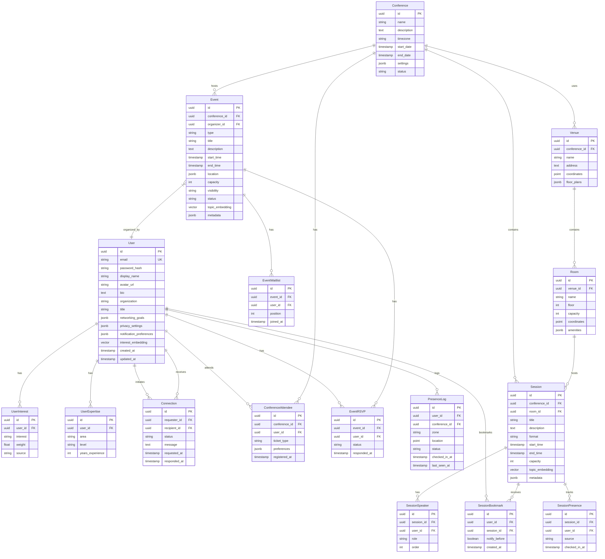

# Konferenco SPARC Specification

> **Version**: 1.0.0
> **Last Updated**: 2026-01-30
> **Status**: Draft
> **Methodology**: SPARC (Specification, Pseudocode, Architecture, Refinement, Completion)

## Table of Contents

1. [Overview](#overview)
2. [Phase 1: Specification](#phase-1-specification)
3. [Phase 2: Pseudocode](#phase-2-pseudocode)
4. [Phase 3: Architecture](#phase-3-architecture)
5. [Phase 4: Refinement](#phase-4-refinement)
6. [Phase 5: Completion](#phase-5-completion)
7. [Appendices](#appendices)

---

## Overview

Konferenco is a next-generation conference management and networking platform designed for the AI/ML community. This document defines the complete SPARC specification covering all development phases from requirements through deployment.

### Vision Statement

Enable meaningful professional connections at AI/ML conferences through intelligent matching, real-time presence awareness, and community-driven grassroots events.

### Core Value Propositions

1. **Intelligent Attendee Matching** - AI-powered recommendations based on research interests, expertise, and networking goals
2. **Real-Time Presence** - Know who's at the conference and where they are
3. **Grassroots Events** - Community-organized meetups, workshops, and discussions
4. **Schedule Optimization** - Personalized agendas maximizing value
5. **Seamless Experience** - Mobile-first, works offline, respects privacy

---

## Phase 1: Specification

### 1.1 Feature Areas

#### 1.1.1 User Management

| Feature ID | Feature | Priority | Complexity |
|------------|---------|----------|------------|
| UM-001 | User Registration & Profile | P0 | Medium |
| UM-002 | OAuth Integration (GitHub, Google, ORCID) | P0 | Medium |
| UM-003 | Professional Profile Builder | P1 | High |
| UM-004 | Privacy Controls | P0 | High |
| UM-005 | Notification Preferences | P1 | Low |

#### 1.1.2 Attendee Matching

| Feature ID | Feature | Priority | Complexity |
|------------|---------|----------|------------|
| AM-001 | Research Interest Extraction | P0 | High |
| AM-002 | Expertise Level Classification | P1 | High |
| AM-003 | Match Score Calculation | P0 | Very High |
| AM-004 | Match Recommendations | P0 | High |
| AM-005 | Connection Requests | P0 | Medium |
| AM-006 | Mutual Interest Detection | P1 | High |

#### 1.1.3 Event Management

| Feature ID | Feature | Priority | Complexity |
|------------|---------|----------|------------|
| EM-001 | Conference Creation | P0 | Medium |
| EM-002 | Session/Talk Management | P0 | Medium |
| EM-003 | Venue & Room Mapping | P1 | Medium |
| EM-004 | Speaker Profiles | P0 | Low |
| EM-005 | Live Session Tracking | P1 | High |

#### 1.1.4 Grassroots Events

| Feature ID | Feature | Priority | Complexity |
|------------|---------|----------|------------|
| GE-001 | Community Event Creation | P0 | Medium |
| GE-002 | Event Discovery | P0 | Medium |
| GE-003 | RSVP & Capacity Management | P0 | Medium |
| GE-004 | Event Ranking Algorithm | P1 | Very High |
| GE-005 | Location Suggestions | P2 | High |

#### 1.1.5 Real-Time Presence

| Feature ID | Feature | Priority | Complexity |
|------------|---------|----------|------------|
| RP-001 | Check-In System | P0 | Medium |
| RP-002 | Location Sharing (Opt-In) | P1 | High |
| RP-003 | Nearby Attendee Alerts | P1 | High |
| RP-004 | Session Attendance Tracking | P1 | Medium |
| RP-005 | Availability Status | P0 | Low |

#### 1.1.6 Schedule Optimization

| Feature ID | Feature | Priority | Complexity |
|------------|---------|----------|------------|
| SO-001 | Personal Schedule Builder | P0 | Medium |
| SO-002 | Conflict Detection | P0 | Medium |
| SO-003 | Smart Recommendations | P1 | Very High |
| SO-004 | Travel Time Calculation | P2 | High |
| SO-005 | Schedule Sharing | P1 | Low |

---

### 1.2 User Stories

#### 1.2.1 Attendee Matching Stories

**US-AM-001: Finding Relevant Connections**
```gherkin
Given I am a registered attendee with a completed profile
  And I have specified my research interests as "transformer architectures, efficient inference"
  And I have set my networking goals to "find collaborators"
When I open the "Find Connections" feature
Then I should see a ranked list of attendees
  And each attendee should have a match score from 0-100
  And the top matches should share at least 2 research interests
  And I should see why we were matched (shared interests, complementary expertise)
```

**US-AM-002: Sending Connection Requests**
```gherkin
Given I am viewing an attendee's profile with match score > 70
When I tap "Connect"
  And I optionally add a personal message
  And I submit the request
Then the other attendee should receive a notification
  And my request should appear in my "Pending Connections" list
  And I should see a confirmation message
```

**US-AM-003: Mutual Interest Detection**
```gherkin
Given I have viewed attendee A's profile 3+ times
  And attendee A has also viewed my profile 2+ times
When the system runs mutual interest detection
Then both parties should receive a "Mutual Interest" notification
  And we should be highlighted in each other's match list
  And the match should be promoted to the top of recommendations
```

#### 1.2.2 Grassroots Event Stories

**US-GE-001: Creating a Community Event**
```gherkin
Given I am a registered attendee at the conference
When I navigate to "Create Event"
  And I fill in the event details:
    | Field | Value |
    | Title | "LLM Inference Optimization Roundtable" |
    | Description | "Discuss techniques for efficient LLM serving" |
    | Date/Time | Conference Day 2, 6:00 PM |
    | Duration | 90 minutes |
    | Capacity | 20 |
    | Location | "Hotel Lobby Lounge" |
    | Topics | "LLM, inference, optimization" |
  And I submit the event
Then the event should be created and visible to other attendees
  And I should be marked as the organizer
  And the event should appear in relevant topic searches
```

**US-GE-002: Discovering Events by Interest**
```gherkin
Given I have research interests including "reinforcement learning"
When I browse the grassroots events section
Then I should see events tagged with "reinforcement learning" first
  And events should be sorted by relevance score
  And I should see attendance count and capacity for each event
```

**US-GE-003: RSVP with Waitlist**
```gherkin
Given an event has reached its capacity of 20 attendees
When I try to RSVP to the event
Then I should be added to a waitlist
  And I should see my waitlist position (e.g., "Position 3")
  And I should receive a notification if a spot opens up
```

#### 1.2.3 Real-Time Presence Stories

**US-RP-001: Check-In to Conference**
```gherkin
Given I am at the conference venue
  And I have location services enabled
When I open the app and tap "Check In"
Then my status should change to "At Conference"
  And nearby attendees with matching interests should be notified (if opted in)
  And I should see a list of currently checked-in attendees I may want to meet
```

**US-RP-002: Session Presence**
```gherkin
Given I am attending a session on "Mixture of Experts"
When I scan the session QR code or manually check in
Then my presence at this session should be recorded
  And other attendees at the same session should be visible to me
  And my connections should see I'm at this session (privacy permitting)
```

**US-RP-003: Nearby Connection Alert**
```gherkin
Given I have connected with attendee B
  And we are both checked in to the conference
  And we are within 50 meters of each other
  And neither of us is marked as "Busy"
When the proximity check runs
Then both of us should receive a "Nearby" notification
  And we should see each other's approximate location (e.g., "Near Hall B")
```

#### 1.2.4 Schedule Optimization Stories

**US-SO-001: Building Personal Schedule**
```gherkin
Given the conference has 100 sessions across 3 days
When I view the schedule
Then I should see sessions sorted by relevance to my interests
  And I should be able to add sessions to "My Schedule"
  And conflicts should be automatically detected and highlighted
```

**US-SO-002: Smart Schedule Suggestions**
```gherkin
Given I have added 5 sessions to my schedule for Day 1
  And there are 3 open time slots
When I request schedule suggestions
Then the system should recommend sessions for empty slots
  And recommendations should consider:
    | Factor | Weight |
    | Research interest match | 40% |
    | Speaker reputation | 20% |
    | Session popularity | 15% |
    | Room proximity | 15% |
    | Break time buffer | 10% |
```

---

### 1.3 Acceptance Criteria

#### 1.3.1 Performance Criteria

| Metric | Target | Measurement |
|--------|--------|-------------|
| Page Load Time | < 2 seconds | P95 latency |
| Match Calculation | < 500ms | Per user pair |
| Search Results | < 300ms | P95 latency |
| Real-time Updates | < 100ms | WebSocket delivery |
| Offline Sync | < 5 seconds | Full sync on reconnect |

#### 1.3.2 Scale Criteria

| Metric | Target |
|--------|--------|
| Concurrent Users | 10,000 per conference |
| Total Attendees | 50,000 per conference |
| Events per Conference | 5,000 (including grassroots) |
| Connections per User | Unlimited |
| Match Calculations | 1M pairs/minute |

#### 1.3.3 Security Criteria

| Requirement | Implementation |
|-------------|----------------|
| Data Encryption | AES-256 at rest, TLS 1.3 in transit |
| Authentication | OAuth 2.0 + PKCE, MFA optional |
| Privacy Controls | Granular per-field visibility |
| GDPR Compliance | Data export, deletion on request |
| Session Management | JWT with 1-hour expiry, refresh tokens |

---

### 1.4 Non-Functional Requirements

#### 1.4.1 Performance Requirements

```yaml
Response Times:
  API_P50: 100ms
  API_P95: 500ms
  API_P99: 1000ms
  WebSocket_Delivery: 100ms

Throughput:
  Read_Operations: 10,000 RPS
  Write_Operations: 1,000 RPS
  WebSocket_Connections: 50,000 concurrent

Resource Usage:
  CPU_Per_Request: < 10ms
  Memory_Per_Connection: < 50KB
  Database_Connections: Pool of 100
```

#### 1.4.2 Availability Requirements

```yaml
Uptime:
  Target: 99.9%
  Maintenance_Window: Sunday 2-4 AM UTC

Recovery:
  RTO: 15 minutes
  RPO: 1 minute

Failover:
  Database: Automatic (< 30s)
  Application: Load-balanced (instant)
  CDN: Multi-region (automatic)
```

#### 1.4.3 Scalability Requirements

```yaml
Horizontal_Scaling:
  Application: Auto-scale 2-20 instances
  Database: Read replicas (1-5)
  Cache: Cluster mode (3-9 nodes)

Vertical_Limits:
  Max_Instance_Size: 8 vCPU, 32GB RAM
  Max_Database_Size: 16 vCPU, 64GB RAM

Data_Growth:
  Users_Per_Month: 50,000
  Events_Per_Month: 10,000
  Connections_Per_Month: 500,000
```

---

## Phase 2: Pseudocode

### 2.1 Attendee Matching Algorithm

```pseudocode
ALGORITHM AttendeeMatching

INPUT:
  user: User                    // The user requesting matches
  attendees: List<User>         // All conference attendees
  conference: Conference        // Current conference context

OUTPUT:
  matches: List<Match>          // Ranked list of potential connections

CONSTANTS:
  INTEREST_WEIGHT = 0.35
  EXPERTISE_WEIGHT = 0.25
  GOAL_WEIGHT = 0.20
  NETWORK_WEIGHT = 0.10
  ACTIVITY_WEIGHT = 0.10

FUNCTION calculateMatchScore(user, candidate):
    // Step 1: Calculate Interest Similarity
    interestScore = cosineSimilarity(
        user.interestVector,
        candidate.interestVector
    )

    // Step 2: Calculate Expertise Complementarity
    expertiseScore = calculateExpertiseMatch(
        user.expertiseAreas,
        candidate.expertiseAreas,
        user.seekingExpertise
    )

    // Step 3: Calculate Goal Alignment
    goalScore = calculateGoalAlignment(
        user.networkingGoals,
        candidate.networkingGoals
    )

    // Step 4: Calculate Network Proximity
    networkScore = calculateNetworkProximity(
        user.connections,
        candidate.connections,
        user.mutualConnections[candidate.id]
    )

    // Step 5: Calculate Activity Relevance
    activityScore = calculateActivityRelevance(
        user.sessionInterests,
        candidate.sessionInterests,
        user.grassrootsEvents,
        candidate.grassrootsEvents
    )

    // Step 6: Weighted Combination
    totalScore = (
        interestScore * INTEREST_WEIGHT +
        expertiseScore * EXPERTISE_WEIGHT +
        goalScore * GOAL_WEIGHT +
        networkScore * NETWORK_WEIGHT +
        activityScore * ACTIVITY_WEIGHT
    )

    RETURN totalScore * 100  // Scale to 0-100

FUNCTION calculateExpertiseMatch(userExpertise, candidateExpertise, seeking):
    // Check if candidate has expertise user is seeking
    matchingExpertise = intersection(candidateExpertise, seeking)
    seekingScore = len(matchingExpertise) / max(len(seeking), 1)

    // Check for complementary expertise (different but related)
    complementaryScore = calculateComplementarity(
        userExpertise,
        candidateExpertise
    )

    RETURN (seekingScore * 0.6) + (complementaryScore * 0.4)

FUNCTION calculateGoalAlignment(userGoals, candidateGoals):
    alignmentMatrix = {
        ("find_collaborators", "find_collaborators"): 1.0,
        ("find_collaborators", "share_research"): 0.8,
        ("find_mentors", "mentor_others"): 1.0,
        ("hiring", "job_seeking"): 1.0,
        ("investor_search", "seeking_funding"): 1.0
    }

    maxAlignment = 0
    FOR each userGoal in userGoals:
        FOR each candidateGoal in candidateGoals:
            alignment = alignmentMatrix.get(
                (userGoal, candidateGoal),
                0.3  // Default low alignment
            )
            maxAlignment = max(maxAlignment, alignment)

    RETURN maxAlignment

FUNCTION findMatches(user, attendees, conference):
    matches = []

    // Filter attendees
    eligibleAttendees = filter(attendees, a =>
        a.id != user.id AND
        a.conferenceId == conference.id AND
        a.privacySettings.allowMatching AND
        NOT user.blockedUsers.contains(a.id) AND
        NOT a.blockedUsers.contains(user.id)
    )

    // Calculate scores in parallel
    FOR EACH candidate IN eligibleAttendees PARALLEL:
        score = calculateMatchScore(user, candidate)

        IF score >= 30:  // Minimum threshold
            reasons = generateMatchReasons(user, candidate)
            matches.append(Match(
                candidate: candidate,
                score: score,
                reasons: reasons,
                mutualInterest: checkMutualInterest(user, candidate)
            ))

    // Sort by score descending
    matches = sortDescending(matches, m => m.score)

    // Boost mutual interests
    FOR EACH match IN matches:
        IF match.mutualInterest:
            match.score = min(100, match.score * 1.2)

    // Re-sort after boost
    matches = sortDescending(matches, m => m.score)

    RETURN matches[0:100]  // Return top 100
```

### 2.2 Schedule Optimization Algorithm

```pseudocode
ALGORITHM ScheduleOptimization

INPUT:
  user: User
  conference: Conference
  userPreferences: SchedulePreferences
  existingSchedule: List<ScheduleItem>

OUTPUT:
  optimizedSchedule: List<ScheduleItem>
  suggestions: List<SessionSuggestion>

CONSTANTS:
  MIN_BREAK_DURATION = 15  // minutes
  WALKING_SPEED = 80       // meters per minute
  MAX_CONSECUTIVE_SESSIONS = 3

FUNCTION optimizeSchedule(user, conference, preferences, existing):
    // Step 1: Build time slot graph
    slots = buildTimeSlots(conference.startDate, conference.endDate)

    // Step 2: Score all available sessions
    sessionScores = {}
    FOR EACH session IN conference.sessions:
        sessionScores[session.id] = scoreSession(user, session, preferences)

    // Step 3: Check existing schedule for conflicts
    conflicts = detectConflicts(existing)
    IF conflicts.length > 0:
        RETURN {
            schedule: existing,
            conflicts: conflicts,
            suggestions: []
        }

    // Step 4: Find empty slots
    emptySlots = findEmptySlots(slots, existing, MIN_BREAK_DURATION)

    // Step 5: Generate suggestions for empty slots
    suggestions = []
    FOR EACH slot IN emptySlots:
        eligibleSessions = filterSessionsByTimeSlot(
            conference.sessions,
            slot,
            existing
        )

        // Rank eligible sessions
        rankedSessions = rankSessions(
            eligibleSessions,
            sessionScores,
            existing,
            user.location
        )

        IF rankedSessions.length > 0:
            suggestions.append(SessionSuggestion(
                slot: slot,
                recommendations: rankedSessions[0:5],
                reason: generateReason(rankedSessions[0], user)
            ))

    RETURN {
        schedule: existing,
        conflicts: [],
        suggestions: suggestions
    }

FUNCTION scoreSession(user, session, preferences):
    score = 0

    // Interest match (40%)
    interestMatch = cosineSimilarity(
        user.interestVector,
        session.topicVector
    )
    score += interestMatch * 0.40

    // Speaker reputation (20%)
    speakerScore = calculateSpeakerScore(session.speakers)
    score += speakerScore * 0.20

    // Popularity factor (15%)
    popularityScore = normalizePopularity(
        session.registrationCount,
        session.capacity
    )
    score += popularityScore * 0.15

    // Time preference (15%)
    timeScore = calculateTimePreference(
        session.startTime,
        preferences.preferredTimes
    )
    score += timeScore * 0.15

    // Format preference (10%)
    formatScore = preferences.formatPreferences.get(
        session.format,
        0.5
    )
    score += formatScore * 0.10

    RETURN score * 100

FUNCTION detectConflicts(schedule):
    conflicts = []
    sortedItems = sortByStartTime(schedule)

    FOR i = 0 TO len(sortedItems) - 2:
        current = sortedItems[i]
        next = sortedItems[i + 1]

        // Check time overlap
        IF current.endTime > next.startTime:
            conflicts.append(Conflict(
                type: "TIME_OVERLAP",
                items: [current, next],
                overlapMinutes: (current.endTime - next.startTime).minutes
            ))

        // Check travel time
        travelTime = calculateTravelTime(
            current.location,
            next.location,
            WALKING_SPEED
        )
        availableTime = (next.startTime - current.endTime).minutes

        IF travelTime > availableTime:
            conflicts.append(Conflict(
                type: "INSUFFICIENT_TRAVEL_TIME",
                items: [current, next],
                requiredMinutes: travelTime,
                availableMinutes: availableTime
            ))

    RETURN conflicts

FUNCTION calculateTravelTime(fromLocation, toLocation, speed):
    IF fromLocation.building != toLocation.building:
        // Different buildings - add transition time
        distance = euclideanDistance(
            fromLocation.coordinates,
            toLocation.coordinates
        )
        RETURN (distance / speed) + 5  // 5 min buffer
    ELSE IF fromLocation.floor != toLocation.floor:
        // Same building, different floors
        floorDiff = abs(fromLocation.floor - toLocation.floor)
        RETURN floorDiff * 2 + 3  // 2 min per floor + 3 min buffer
    ELSE:
        // Same floor
        RETURN 3  // Minimum transition time
```

### 2.3 Event Recommendation Algorithm

```pseudocode
ALGORITHM EventRecommendation

INPUT:
  user: User
  events: List<Event>          // All grassroots + official events
  context: RecommendationContext

OUTPUT:
  recommendations: List<EventRecommendation>

FUNCTION recommendEvents(user, events, context):
    // Step 1: Filter events by eligibility
    eligibleEvents = filter(events, e =>
        e.startTime > context.currentTime AND
        e.capacity > e.attendeeCount AND
        NOT user.declinedEvents.contains(e.id) AND
        (e.visibility == "public" OR
         e.invitedUsers.contains(user.id))
    )

    // Step 2: Calculate relevance scores
    scoredEvents = []
    FOR EACH event IN eligibleEvents:
        score = calculateEventRelevance(user, event, context)
        scoredEvents.append((event, score))

    // Step 3: Apply diversity boost
    scoredEvents = applyDiversityBoost(scoredEvents, user)

    // Step 4: Apply social signals
    scoredEvents = applySocialSignals(scoredEvents, user)

    // Step 5: Sort and return
    sortedEvents = sortDescending(scoredEvents, e => e.score)

    recommendations = []
    FOR EACH (event, score) IN sortedEvents[0:20]:
        recommendations.append(EventRecommendation(
            event: event,
            score: score,
            reason: generateEventReason(user, event),
            socialProof: getSocialProof(user, event)
        ))

    RETURN recommendations

FUNCTION calculateEventRelevance(user, event, context):
    score = 0

    // Topic match (35%)
    topicScore = calculateTopicMatch(
        user.interestVector,
        event.topicVector
    )
    score += topicScore * 0.35

    // Organizer credibility (20%)
    organizerScore = calculateOrganizerCredibility(event.organizer)
    score += organizerScore * 0.20

    // Social relevance (20%)
    socialScore = calculateSocialRelevance(user, event)
    score += socialScore * 0.20

    // Timing convenience (15%)
    timingScore = calculateTimingScore(
        event.startTime,
        user.schedule,
        context.currentLocation
    )
    score += timingScore * 0.15

    // Engagement signals (10%)
    engagementScore = calculateEngagementSignals(event)
    score += engagementScore * 0.10

    RETURN score

FUNCTION calculateSocialRelevance(user, event):
    // Check if connections are attending
    connectionAttendees = intersection(
        user.connections,
        event.attendees
    )
    connectionScore = min(1.0, len(connectionAttendees) * 0.2)

    // Check if matches are attending
    matchAttendees = filter(
        user.topMatches[0:50],
        m => event.attendees.contains(m.id)
    )
    matchScore = min(1.0, len(matchAttendees) * 0.15)

    // Check if organizer is a connection
    organizerBonus = 0.3 IF user.connections.contains(event.organizer.id) ELSE 0

    RETURN min(1.0, connectionScore + matchScore + organizerBonus)
```

### 2.4 Real-Time Presence Algorithm

```pseudocode
ALGORITHM RealTimePresence

INPUT:
  user: User
  conference: Conference
  locationUpdate: LocationUpdate

OUTPUT:
  presenceState: PresenceState
  notifications: List<Notification>

CONSTANTS:
  PROXIMITY_THRESHOLD = 50      // meters
  PRESENCE_EXPIRY = 300         // seconds
  NOTIFICATION_COOLDOWN = 1800  // seconds (30 min)

FUNCTION processLocationUpdate(user, conference, locationUpdate):
    // Step 1: Validate and sanitize location
    IF NOT isValidLocation(locationUpdate, conference.bounds):
        RETURN {state: user.currentState, notifications: []}

    // Step 2: Update user presence
    presence = updatePresence(user, locationUpdate)

    // Step 3: Determine zone
    zone = determineZone(locationUpdate.coordinates, conference.zones)
    presence.currentZone = zone

    // Step 4: Check for nearby connections
    notifications = []
    nearbyConnections = findNearbyConnections(
        user,
        locationUpdate.coordinates,
        PROXIMITY_THRESHOLD
    )

    FOR EACH connection IN nearbyConnections:
        IF shouldNotify(user, connection):
            notifications.append(createProximityNotification(
                user,
                connection,
                zone
            ))
            recordNotification(user, connection)

    // Step 5: Update session presence if applicable
    activeSession = findActiveSession(
        conference.sessions,
        locationUpdate.coordinates,
        locationUpdate.timestamp
    )

    IF activeSession != NULL:
        updateSessionPresence(user, activeSession)

    RETURN {
        state: presence,
        notifications: notifications
    }

FUNCTION findNearbyConnections(user, coordinates, threshold):
    nearby = []

    // Query spatial index for users within threshold
    candidateUsers = spatialIndex.queryRadius(
        coordinates,
        threshold
    )

    FOR EACH candidate IN candidateUsers:
        IF candidate.id == user.id:
            CONTINUE

        // Check if connected
        IF NOT user.connections.contains(candidate.id):
            CONTINUE

        // Check privacy settings
        IF NOT candidate.privacySettings.shareLocation:
            CONTINUE

        // Check availability
        IF candidate.status == "BUSY" OR candidate.status == "DND":
            CONTINUE

        // Calculate precise distance
        distance = haversineDistance(
            coordinates,
            candidate.lastLocation.coordinates
        )

        IF distance <= threshold:
            nearby.append({
                user: candidate,
                distance: distance,
                zone: candidate.currentZone
            })

    RETURN nearby

FUNCTION shouldNotify(user, connection):
    // Check notification cooldown
    lastNotification = getLastNotification(user.id, connection.id)
    IF lastNotification != NULL:
        timeSince = currentTime() - lastNotification.timestamp
        IF timeSince < NOTIFICATION_COOLDOWN:
            RETURN FALSE

    // Check user preferences
    IF NOT user.notificationPreferences.proximityAlerts:
        RETURN FALSE

    // Check quiet hours
    IF isQuietHours(user, currentTime()):
        RETURN FALSE

    RETURN TRUE

FUNCTION updateSessionPresence(user, session):
    presence = SessionPresence(
        userId: user.id,
        sessionId: session.id,
        checkedInAt: currentTime(),
        source: "LOCATION"  // vs "QR_CODE" or "MANUAL"
    )

    // Store presence
    sessionPresenceStore.upsert(presence)

    // Notify session attendees (if enabled)
    IF session.settings.announceAttendees:
        notifySessionAttendees(session, user, "JOINED")

    // Update user's activity feed
    updateActivityFeed(user, "SESSION_JOINED", session)
```

### 2.5 Grassroots Event Ranking Algorithm

```pseudocode
ALGORITHM GrassrootsEventRanking

INPUT:
  events: List<GrassrootsEvent>
  user: User (optional)
  rankingContext: RankingContext

OUTPUT:
  rankedEvents: List<RankedEvent>

CONSTANTS:
  QUALITY_WEIGHT = 0.30
  ENGAGEMENT_WEIGHT = 0.25
  RELEVANCE_WEIGHT = 0.25
  FRESHNESS_WEIGHT = 0.10
  SOCIAL_WEIGHT = 0.10

FUNCTION rankGrassrootsEvents(events, user, context):
    rankedEvents = []

    FOR EACH event IN events:
        // Calculate component scores
        qualityScore = calculateQualityScore(event)
        engagementScore = calculateEngagementScore(event)
        freshnessScore = calculateFreshnessScore(event, context)

        // User-specific scores (if logged in)
        IF user != NULL:
            relevanceScore = calculateRelevanceScore(event, user)
            socialScore = calculateSocialScore(event, user)
        ELSE:
            relevanceScore = 0.5  // Neutral
            socialScore = 0.5    // Neutral

        // Weighted combination
        totalScore = (
            qualityScore * QUALITY_WEIGHT +
            engagementScore * ENGAGEMENT_WEIGHT +
            relevanceScore * RELEVANCE_WEIGHT +
            freshnessScore * FRESHNESS_WEIGHT +
            socialScore * SOCIAL_WEIGHT
        )

        // Apply boosts and penalties
        totalScore = applyModifiers(totalScore, event, context)

        rankedEvents.append(RankedEvent(
            event: event,
            score: totalScore,
            breakdown: {
                quality: qualityScore,
                engagement: engagementScore,
                relevance: relevanceScore,
                freshness: freshnessScore,
                social: socialScore
            }
        ))

    // Sort by score
    rankedEvents = sortDescending(rankedEvents, e => e.score)

    RETURN rankedEvents

FUNCTION calculateQualityScore(event):
    score = 0

    // Organizer reputation (40%)
    organizerRep = getOrganizerReputation(event.organizer)
    score += organizerRep * 0.40

    // Description quality (30%)
    descQuality = evaluateDescriptionQuality(event.description)
    score += descQuality * 0.30

    // Completeness (20%)
    completeness = calculateCompleteness(event)
    score += completeness * 0.20

    // Verified status (10%)
    IF event.isVerified:
        score += 0.10

    RETURN score

FUNCTION calculateEngagementScore(event):
    // RSVP ratio
    rsvpRatio = event.attendeeCount / max(event.capacity, 1)
    rsvpScore = min(1.0, rsvpRatio * 1.2)  // Slight boost for popular events

    // Comments and questions
    discussionScore = min(1.0, event.commentCount * 0.1)

    // View-to-RSVP conversion
    IF event.viewCount > 0:
        conversionRate = event.attendeeCount / event.viewCount
        conversionScore = min(1.0, conversionRate * 10)
    ELSE:
        conversionScore = 0.5

    RETURN (rsvpScore * 0.5) + (discussionScore * 0.3) + (conversionScore * 0.2)

FUNCTION calculateFreshnessScore(event, context):
    // Time since creation
    hoursSinceCreation = (context.currentTime - event.createdAt).hours
    creationDecay = exp(-hoursSinceCreation / 48)  // 48-hour half-life

    // Time until event
    hoursUntilEvent = (event.startTime - context.currentTime).hours

    IF hoursUntilEvent < 0:
        // Event has passed
        RETURN 0
    ELSE IF hoursUntilEvent < 2:
        // Starting soon - boost
        urgencyBoost = 1.0
    ELSE IF hoursUntilEvent < 24:
        // Within a day
        urgencyBoost = 0.8
    ELSE:
        urgencyBoost = 0.5

    RETURN (creationDecay * 0.4) + (urgencyBoost * 0.6)

FUNCTION applyModifiers(score, event, context):
    modifiedScore = score

    // Boost: Featured by organizers
    IF event.isFeatured:
        modifiedScore *= 1.3

    // Boost: Has available spots and starting soon
    IF event.attendeeCount < event.capacity AND event.hoursUntilStart < 4:
        modifiedScore *= 1.2

    // Penalty: Low-quality signals
    IF event.reportCount > 0:
        modifiedScore *= (1.0 - min(0.5, event.reportCount * 0.1))

    // Penalty: Organizer has cancelled events before
    cancellationRate = getOrganizerCancellationRate(event.organizer)
    IF cancellationRate > 0.1:
        modifiedScore *= (1.0 - cancellationRate)

    RETURN min(1.0, max(0.0, modifiedScore))
```

---

## Phase 3: Architecture

### 3.1 Architecture Decision Records Reference

| ADR | Title | Status |
|-----|-------|--------|
| [ADR-001](../adr/adr-001-system-architecture.md) | System Architecture Overview | Proposed |
| [ADR-002](../adr/adr-002-technology-stack.md) | Technology Stack Selection | Proposed |
| [ADR-003](../adr/adr-003-database-design.md) | Database Design & Data Models | Proposed |
| [ADR-004](../adr/adr-004-real-time-infrastructure.md) | Real-Time Infrastructure | Proposed |
| [ADR-005](../adr/adr-005-security-architecture.md) | Security & Privacy Architecture | Proposed |

### 3.2 System Integration Diagram


### 3.3 API Contracts

#### 3.3.1 User API

```yaml
openapi: 3.0.3
info:
  title: Konferenco User API
  version: 1.0.0

paths:
  /api/v1/users/me:
    get:
      summary: Get current user profile
      security:
        - bearerAuth: []
      responses:
        200:
          description: User profile
          content:
            application/json:
              schema:
                $ref: '#/components/schemas/User'

    patch:
      summary: Update user profile
      security:
        - bearerAuth: []
      requestBody:
        content:
          application/json:
            schema:
              $ref: '#/components/schemas/UserUpdate'
      responses:
        200:
          description: Updated user profile
          content:
            application/json:
              schema:
                $ref: '#/components/schemas/User'

  /api/v1/users/{userId}:
    get:
      summary: Get user by ID
      security:
        - bearerAuth: []
      parameters:
        - name: userId
          in: path
          required: true
          schema:
            type: string
            format: uuid
      responses:
        200:
          description: User profile (respects privacy settings)
          content:
            application/json:
              schema:
                $ref: '#/components/schemas/PublicUser'

components:
  schemas:
    User:
      type: object
      properties:
        id:
          type: string
          format: uuid
        email:
          type: string
          format: email
        displayName:
          type: string
        avatarUrl:
          type: string
          format: uri
        bio:
          type: string
          maxLength: 500
        organization:
          type: string
        title:
          type: string
        researchInterests:
          type: array
          items:
            type: string
        expertiseAreas:
          type: array
          items:
            $ref: '#/components/schemas/Expertise'
        networkingGoals:
          type: array
          items:
            type: string
            enum:
              - find_collaborators
              - share_research
              - find_mentors
              - mentor_others
              - hiring
              - job_seeking
              - investor_search
              - seeking_funding
              - general_networking
        privacySettings:
          $ref: '#/components/schemas/PrivacySettings'
        createdAt:
          type: string
          format: date-time
        updatedAt:
          type: string
          format: date-time

    Expertise:
      type: object
      properties:
        area:
          type: string
        level:
          type: string
          enum: [beginner, intermediate, advanced, expert]
        yearsExperience:
          type: integer
          minimum: 0

    PrivacySettings:
      type: object
      properties:
        profileVisibility:
          type: string
          enum: [public, connections, private]
        showEmail:
          type: boolean
        showOrganization:
          type: boolean
        allowMatching:
          type: boolean
        shareLocation:
          type: boolean
        showOnlineStatus:
          type: boolean

  securitySchemes:
    bearerAuth:
      type: http
      scheme: bearer
      bearerFormat: JWT
```

#### 3.3.2 Matching API

```yaml
paths:
  /api/v1/matches:
    get:
      summary: Get match recommendations
      security:
        - bearerAuth: []
      parameters:
        - name: conferenceId
          in: query
          required: true
          schema:
            type: string
            format: uuid
        - name: limit
          in: query
          schema:
            type: integer
            default: 20
            maximum: 100
        - name: offset
          in: query
          schema:
            type: integer
            default: 0
      responses:
        200:
          description: List of match recommendations
          content:
            application/json:
              schema:
                type: object
                properties:
                  matches:
                    type: array
                    items:
                      $ref: '#/components/schemas/Match'
                  pagination:
                    $ref: '#/components/schemas/Pagination'

  /api/v1/matches/{matchId}/connect:
    post:
      summary: Send connection request
      security:
        - bearerAuth: []
      parameters:
        - name: matchId
          in: path
          required: true
          schema:
            type: string
            format: uuid
      requestBody:
        content:
          application/json:
            schema:
              type: object
              properties:
                message:
                  type: string
                  maxLength: 500
      responses:
        201:
          description: Connection request sent
          content:
            application/json:
              schema:
                $ref: '#/components/schemas/ConnectionRequest'

components:
  schemas:
    Match:
      type: object
      properties:
        id:
          type: string
          format: uuid
        user:
          $ref: '#/components/schemas/PublicUser'
        score:
          type: number
          minimum: 0
          maximum: 100
        reasons:
          type: array
          items:
            $ref: '#/components/schemas/MatchReason'
        mutualInterest:
          type: boolean
        connectionStatus:
          type: string
          enum: [none, pending_sent, pending_received, connected]

    MatchReason:
      type: object
      properties:
        type:
          type: string
          enum:
            - shared_interest
            - complementary_expertise
            - goal_alignment
            - mutual_connection
            - same_session
            - same_event
        detail:
          type: string
        weight:
          type: number
```

#### 3.3.3 Events API

```yaml
paths:
  /api/v1/events:
    get:
      summary: List events
      parameters:
        - name: conferenceId
          in: query
          required: true
          schema:
            type: string
            format: uuid
        - name: type
          in: query
          schema:
            type: string
            enum: [official, grassroots, all]
            default: all
        - name: startAfter
          in: query
          schema:
            type: string
            format: date-time
        - name: topics
          in: query
          schema:
            type: array
            items:
              type: string
      responses:
        200:
          description: List of events
          content:
            application/json:
              schema:
                type: object
                properties:
                  events:
                    type: array
                    items:
                      $ref: '#/components/schemas/Event'

    post:
      summary: Create grassroots event
      security:
        - bearerAuth: []
      requestBody:
        content:
          application/json:
            schema:
              $ref: '#/components/schemas/CreateEvent'
      responses:
        201:
          description: Event created
          content:
            application/json:
              schema:
                $ref: '#/components/schemas/Event'

  /api/v1/events/{eventId}/rsvp:
    post:
      summary: RSVP to event
      security:
        - bearerAuth: []
      parameters:
        - name: eventId
          in: path
          required: true
          schema:
            type: string
            format: uuid
      responses:
        200:
          description: RSVP confirmed
          content:
            application/json:
              schema:
                $ref: '#/components/schemas/RSVP'
        202:
          description: Added to waitlist
          content:
            application/json:
              schema:
                $ref: '#/components/schemas/WaitlistEntry'

components:
  schemas:
    Event:
      type: object
      properties:
        id:
          type: string
          format: uuid
        type:
          type: string
          enum: [official, grassroots]
        title:
          type: string
        description:
          type: string
        organizer:
          $ref: '#/components/schemas/PublicUser'
        startTime:
          type: string
          format: date-time
        endTime:
          type: string
          format: date-time
        duration:
          type: integer
          description: Duration in minutes
        location:
          $ref: '#/components/schemas/Location'
        capacity:
          type: integer
        attendeeCount:
          type: integer
        waitlistCount:
          type: integer
        topics:
          type: array
          items:
            type: string
        format:
          type: string
          enum: [talk, workshop, panel, roundtable, networking, other]
        visibility:
          type: string
          enum: [public, invite_only]
        rsvpStatus:
          type: string
          enum: [none, attending, waitlisted, declined]

    CreateEvent:
      type: object
      required:
        - title
        - description
        - startTime
        - duration
        - capacity
      properties:
        title:
          type: string
          minLength: 5
          maxLength: 100
        description:
          type: string
          minLength: 20
          maxLength: 2000
        startTime:
          type: string
          format: date-time
        duration:
          type: integer
          minimum: 15
          maximum: 480
        location:
          type: object
          properties:
            name:
              type: string
            coordinates:
              type: object
              properties:
                latitude:
                  type: number
                longitude:
                  type: number
        capacity:
          type: integer
          minimum: 2
          maximum: 500
        topics:
          type: array
          items:
            type: string
          maxItems: 5
        format:
          type: string
          enum: [talk, workshop, panel, roundtable, networking, other]
        visibility:
          type: string
          enum: [public, invite_only]
          default: public
```

### 3.4 Data Models



---

## Phase 4: Refinement

### 4.1 Iterative Improvement Process


#### 4.1.1 Development Iterations

| Iteration | Focus Area | Duration | Key Deliverables |
|-----------|------------|----------|------------------|
| Alpha 1 | Core Infrastructure | 4 weeks | Auth, User profiles, Basic events |
| Alpha 2 | Matching MVP | 4 weeks | Interest extraction, Basic matching |
| Alpha 3 | Real-Time | 4 weeks | Presence, Notifications |
| Beta 1 | Grassroots Events | 3 weeks | Event creation, RSVP, Ranking |
| Beta 2 | Schedule Optimization | 3 weeks | Personal schedules, Suggestions |
| Beta 3 | Polish & Performance | 3 weeks | UI refinement, Load testing |
| RC 1 | Hardening | 2 weeks | Security audit, Bug fixes |

#### 4.1.2 Feature Refinement Checklist

```markdown
## Feature Refinement Checklist

### Code Quality
- [ ] Code review completed (2+ approvers)
- [ ] Unit test coverage >= 80%
- [ ] Integration tests passing
- [ ] No critical/high severity linting issues
- [ ] Documentation updated

### Performance
- [ ] Load tested at 2x expected traffic
- [ ] P95 latency within SLA
- [ ] No memory leaks detected
- [ ] Database queries optimized (EXPLAIN analyzed)
- [ ] Caching strategy implemented

### Security
- [ ] OWASP Top 10 review completed
- [ ] Input validation implemented
- [ ] Authentication/authorization tested
- [ ] Sensitive data handling reviewed
- [ ] Rate limiting configured

### Accessibility
- [ ] WCAG 2.1 AA compliant
- [ ] Screen reader tested
- [ ] Keyboard navigation working
- [ ] Color contrast verified
- [ ] Focus indicators visible

### User Experience
- [ ] Design review approved
- [ ] Error states handled gracefully
- [ ] Loading states implemented
- [ ] Offline behavior defined
- [ ] Mobile responsiveness verified
```

### 4.2 Feedback Loop Mechanisms

#### 4.2.1 Automated Feedback Collection

```yaml
Feedback Channels:
  In-App Feedback:
    trigger: User-initiated or contextual prompts
    data_collected:
      - Feature area
      - Satisfaction rating (1-5)
      - Free-text comments
      - Screenshot (optional)
      - Session context
    processing:
      - Sentiment analysis
      - Topic categorization
      - Priority scoring

  Behavior Analytics:
    tool: Mixpanel/Amplitude
    events_tracked:
      - Feature usage
      - Drop-off points
      - Session duration
      - Feature discovery rate
    analysis:
      - Funnel analysis
      - Cohort retention
      - Feature adoption curves

  Error Tracking:
    tool: Sentry
    captured:
      - JavaScript exceptions
      - API errors
      - Performance issues
    alerting:
      - Slack notification for new errors
      - PagerDuty for critical issues

  Support Integration:
    tool: Intercom/Zendesk
    sync:
      - Tag support tickets by feature
      - Auto-link to product backlog
      - Sentiment trending
```

#### 4.2.2 Feedback Processing Pipeline


### 4.3 A/B Testing Strategy

#### 4.3.1 Testing Framework

```yaml
A/B Testing Configuration:
  Platform: LaunchDarkly / Statsig

  Test Categories:
    Algorithm Tests:
      - Match scoring weights
      - Recommendation ranking
      - Event sorting
      duration: 2-4 weeks
      success_metrics:
        - Connection acceptance rate
        - Session attendance
        - Event RSVP rate

    UI/UX Tests:
      - Component layouts
      - Navigation flows
      - Onboarding variants
      duration: 1-2 weeks
      success_metrics:
        - Task completion rate
        - Time to action
        - User satisfaction

    Feature Tests:
      - New feature rollout
      - Feature flag variants
      duration: 2-4 weeks
      success_metrics:
        - Adoption rate
        - Retention impact
        - Engagement metrics

  Statistical Rigor:
    minimum_sample_size: 1000 users per variant
    significance_level: 0.05
    minimum_detectable_effect: 5%
    power: 0.8
```

#### 4.3.2 Planned A/B Tests

| Test ID | Hypothesis | Variants | Primary Metric | Duration |
|---------|------------|----------|----------------|----------|
| AB-001 | Interest weight 40% improves match quality | 35% / 40% / 45% | Connection rate | 3 weeks |
| AB-002 | Mutual interest badge increases engagement | No badge / Badge | Message rate | 2 weeks |
| AB-003 | Social proof in events increases RSVP | None / "X attending" | RSVP rate | 2 weeks |
| AB-004 | Personalized recommendations improve adoption | Generic / Personalized | Schedule items added | 3 weeks |
| AB-005 | Proximity notifications drive meetings | Off / Conservative / Aggressive | Meeting confirmations | 3 weeks |

### 4.4 Performance Optimization Cycles

#### 4.4.1 Performance Monitoring

```yaml
Monitoring Stack:
  APM: Datadog / New Relic

  Key Metrics:
    API Latency:
      P50: < 100ms (target)
      P95: < 500ms (target)
      P99: < 1000ms (target)
      alert_threshold: P95 > 800ms for 5 min

    Database:
      query_time_p95: < 50ms
      connection_pool_usage: < 70%
      slow_query_threshold: 100ms

    Cache:
      hit_rate: > 90%
      latency_p95: < 10ms

    WebSocket:
      connection_count: monitor
      message_latency_p95: < 100ms
      reconnection_rate: < 5%

  Dashboards:
    - Real-time system health
    - API endpoint breakdown
    - Database query analysis
    - Cache performance
    - Error rates by service
```

#### 4.4.2 Optimization Cycles


#### 4.4.3 Optimization Backlog

| Priority | Area | Issue | Target Improvement |
|----------|------|-------|-------------------|
| P0 | Matching | Embedding calculation slow | 10x speedup |
| P0 | Search | Full-text search latency | P95 < 200ms |
| P1 | Database | N+1 queries in event list | 50% fewer queries |
| P1 | WebSocket | Connection memory overhead | 30% reduction |
| P2 | Cache | Low hit rate for user profiles | 95% hit rate |
| P2 | Frontend | Bundle size | 40% reduction |

---

## Phase 5: Completion

### 5.1 Definition of Done

#### 5.1.1 Feature-Level Definition of Done

```markdown
## Feature Definition of Done

A feature is considered DONE when ALL of the following are true:

### Development Complete
- [ ] All acceptance criteria met
- [ ] Code merged to main branch
- [ ] No known critical or high-severity bugs
- [ ] Technical debt documented (if any deferred)

### Quality Assurance
- [ ] Unit tests written and passing (>= 80% coverage)
- [ ] Integration tests written and passing
- [ ] E2E tests for critical paths
- [ ] Manual QA sign-off
- [ ] Regression suite passing

### Performance Verified
- [ ] Performance benchmarks met
- [ ] No degradation from baseline
- [ ] Load tested at expected scale

### Security Cleared
- [ ] Security review completed
- [ ] No open security vulnerabilities
- [ ] Privacy impact assessed

### Documentation Updated
- [ ] API documentation current
- [ ] User-facing help updated
- [ ] Internal runbook updated (if applicable)
- [ ] Changelog entry added

### Deployment Ready
- [ ] Feature flags configured
- [ ] Monitoring/alerting set up
- [ ] Rollback plan documented
- [ ] Stakeholder approval obtained
```

#### 5.1.2 Release-Level Definition of Done

```markdown
## Release Definition of Done

A release is DONE when:

### All Features Complete
- [ ] All planned features meet Feature DoD
- [ ] Release scope confirmed and documented

### Integration Verified
- [ ] All features work together
- [ ] Cross-feature test scenarios passing
- [ ] API versioning correct

### Non-Functional Requirements Met
- [ ] Performance targets achieved
- [ ] Security audit passed
- [ ] Accessibility audit passed
- [ ] Scalability verified

### Operational Readiness
- [ ] Runbooks updated
- [ ] On-call team briefed
- [ ] Monitoring dashboards ready
- [ ] Alerting thresholds set
- [ ] Incident response plan reviewed

### Stakeholder Sign-off
- [ ] Product owner approval
- [ ] Engineering lead approval
- [ ] Security team approval
- [ ] Legal/compliance review (if applicable)
```

### 5.2 Quality Gates


#### 5.2.1 Gate Criteria

| Gate | Criteria | Automated | Manual |
|------|----------|-----------|--------|
| **Code Quality** | Lint pass, tests pass, coverage >= 80%, 2 approvals | Yes | Code review |
| **Integration** | All integration tests pass, contracts valid | Yes | Schema review |
| **Staging** | E2E pass, P95 < 500ms, no critical vulns | Mostly | QA sign-off |
| **Production** | Canary healthy, no errors, metrics normal | Yes | On-call approval |

### 5.3 Launch Checklist

#### 5.3.1 Pre-Launch (T-14 days)

```markdown
## Pre-Launch Checklist

### Infrastructure
- [ ] Production environment provisioned
- [ ] Database scaled appropriately
- [ ] CDN configured and tested
- [ ] SSL certificates valid
- [ ] DNS configured
- [ ] Load balancer configured

### Security
- [ ] Penetration test completed
- [ ] Security audit completed
- [ ] API rate limiting configured
- [ ] DDoS protection enabled
- [ ] WAF rules configured

### Monitoring
- [ ] APM configured
- [ ] Log aggregation set up
- [ ] Alerting rules defined
- [ ] On-call rotation scheduled
- [ ] Escalation paths documented

### Data
- [ ] Database backups tested
- [ ] Data migration scripts tested
- [ ] Seed data prepared
- [ ] GDPR compliance verified

### Legal/Compliance
- [ ] Terms of Service published
- [ ] Privacy Policy published
- [ ] Cookie consent implemented
- [ ] Accessibility statement published
```

#### 5.3.2 Launch Day (T-0)

```markdown
## Launch Day Checklist

### Pre-Launch (T-4 hours)
- [ ] All team members on standby
- [ ] Communication channels ready
- [ ] Status page prepared
- [ ] Rollback plan reviewed
- [ ] Final staging verification

### Launch Sequence
- [ ] Feature flags enabled
- [ ] Canary deployment (5%)
- [ ] Monitor for 30 minutes
- [ ] Expand to 25%
- [ ] Monitor for 30 minutes
- [ ] Expand to 50%
- [ ] Monitor for 30 minutes
- [ ] Full rollout (100%)

### Post-Launch Verification
- [ ] All critical paths working
- [ ] No elevated error rates
- [ ] Performance within targets
- [ ] User registrations flowing
- [ ] Payments processing (if applicable)

### Communication
- [ ] Status page updated
- [ ] Social media announcement
- [ ] Email to early adopters
- [ ] Press release (if applicable)
```

#### 5.3.3 Post-Launch (T+1 to T+7)

```markdown
## Post-Launch Checklist

### Day 1
- [ ] 24/7 monitoring active
- [ ] Hotfix process ready
- [ ] User feedback collection active
- [ ] Support team briefed and ready

### Day 2-3
- [ ] First batch of user feedback reviewed
- [ ] Quick wins identified and scheduled
- [ ] Performance baseline established
- [ ] Bug triage completed

### Day 4-7
- [ ] Weekly metrics review
- [ ] User satisfaction survey sent
- [ ] Retrospective scheduled
- [ ] Next iteration planned
```

### 5.4 Post-Launch Monitoring

#### 5.4.1 Monitoring Dashboard

```yaml
Launch Monitoring Dashboard:
  Sections:
    Real-Time Health:
      metrics:
        - Request rate (RPS)
        - Error rate (%)
        - P50/P95/P99 latency
        - Active users
      refresh: 10 seconds

    Business Metrics:
      metrics:
        - New registrations
        - Connections made
        - Events created
        - Session bookmarks
      refresh: 1 minute

    Infrastructure:
      metrics:
        - CPU utilization
        - Memory usage
        - Database connections
        - Cache hit rate
      refresh: 30 seconds

    Errors:
      metrics:
        - Error count by type
        - Top error messages
        - Affected users
      refresh: 30 seconds

  Alerts:
    Critical:
      - Error rate > 5% for 2 minutes
      - P99 latency > 5s for 5 minutes
      - Database connection pool exhausted
      channel: PagerDuty

    Warning:
      - Error rate > 1% for 5 minutes
      - P95 latency > 1s for 10 minutes
      - Cache hit rate < 80%
      channel: Slack #alerts

    Info:
      - New feature adoption rate
      - Daily active users change
      channel: Slack #metrics
```

#### 5.4.2 Key Performance Indicators

| KPI | Target | Alert Threshold | Measurement |
|-----|--------|-----------------|-------------|
| **Availability** | 99.9% | < 99.5% | Uptime monitoring |
| **API Latency (P95)** | < 500ms | > 800ms | APM |
| **Error Rate** | < 0.1% | > 1% | Error tracking |
| **User Registration Success** | > 95% | < 90% | Funnel analysis |
| **Connection Request Rate** | Baseline + 10% | -20% | Analytics |
| **Event Creation Rate** | Baseline + 15% | -25% | Analytics |
| **Session Bookmark Rate** | > 50% of users | < 30% | Analytics |
| **Mobile App Crash Rate** | < 0.5% | > 1% | Crashlytics |
| **Push Notification Delivery** | > 98% | < 95% | Push service |

#### 5.4.3 Incident Response


---

## Appendices

### Appendix A: Glossary

| Term | Definition |
|------|------------|
| **Attendee** | A registered user attending a conference |
| **Connection** | A mutual relationship between two attendees |
| **Grassroots Event** | Community-organized event within a conference |
| **Match Score** | 0-100 score indicating compatibility between attendees |
| **Presence** | Real-time location/status of an attendee at the conference |
| **RSVP** | Registration of intent to attend an event |
| **Session** | Official conference talk, workshop, or presentation |
| **Waitlist** | Queue for events at capacity |

### Appendix B: Related Documents

| Document | Location | Description |
|----------|----------|-------------|
| Product Requirements Document | `../prd/` | Detailed product requirements |
| Architecture Decision Records | `../adr/` | Technical decisions and rationale |
| Research Documents | `../research/` | Market and technical research |
| API Documentation | `/docs/api/` | Complete API reference |

### Appendix C: Version History

| Version | Date | Author | Changes |
|---------|------|--------|---------|
| 1.0.0 | 2026-01-30 | Konferenco Team | Initial SPARC specification |

---

*This document follows the SPARC methodology for systematic software development. Each phase builds upon the previous, ensuring comprehensive coverage from requirements through deployment.*
